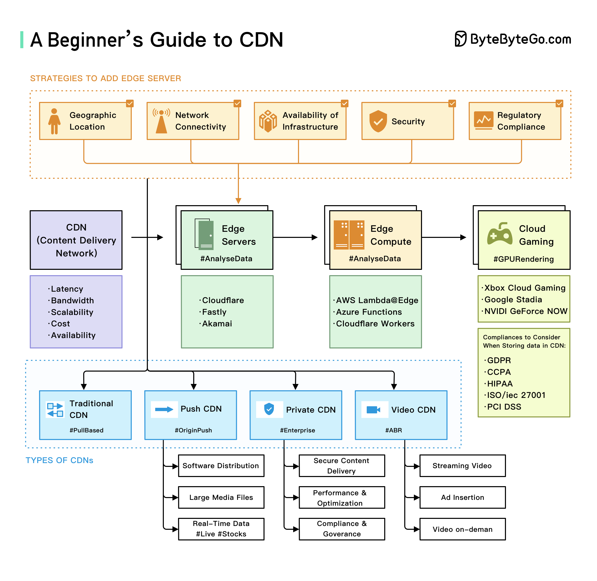

# 🌐 CDN入门指南

> 网站加载慢？CDN帮你提速到飞起

CDN（内容分发网络）是分布式服务器网络，能提升内容交付的性能、可靠性和安全性 👇

📌 **边缘服务器** — 部署在离用户更近的位置，减少延迟，提升访问速度

📌 **边缘计算** — 在靠近用户的地方处理数据，而不是在远程数据中心。视频流、在线游戏等实时应用特别需要

📌 **云游戏** — 利用云计算提供高质量、低延迟的游戏体验

这些技术正在改变我们访问和消费数字内容的方式：
- 更快的加载速度
- 更可靠的服务
- 更沉浸的用户体验

💡 简单理解：CDN就像在全国各地开了"分店"，用户访问时去最近的"分店"取货，不用跑到"总部"。

---

#CDN #网络 #Web开发 #程序员 #性能优化 #技术干货 #前端
