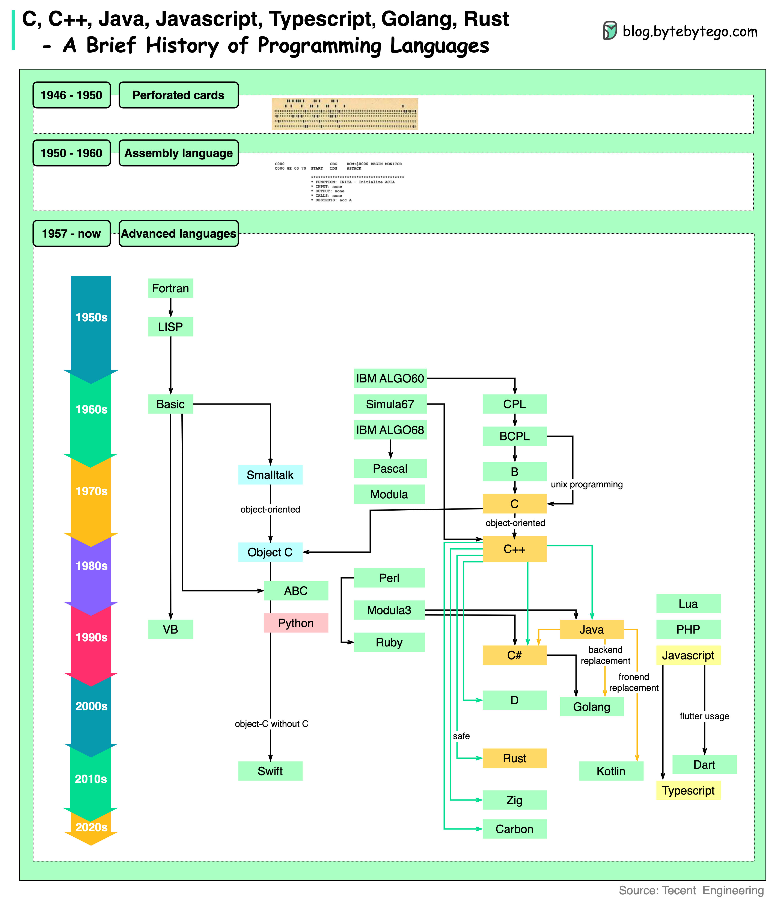

# 💻 编程语言70年进化史

> 一张图看懂编程语言的前世今生

C、Java、Python、Go、Rust……这些语言是怎么一步步演化来的？👇

📌 **1950s** — 打孔卡（第一代）→ 汇编语言（第二代）→ Fortran、LISP（第三代，面向人类）

📌 **1972** — 两个重量级语言诞生：Smalltalk（影响了后来的脚本语言）和 C（为Unix而生）

📌 **1980s** — 面向对象兴起，Objective-C 和 C++ 登场

📌 **1990s** — PC变便宜了，语言开始强调安全和简洁。Python诞生，1995年Java、JavaScript、PHP、Ruby集体亮相

📌 **2000s** — 微软推出C#，虽然绑定.NET但功能强大

📌 **2010s** — 新语言涌现：
- C++家族：Rust、Zig、Carbon
- Java家族：Go、Kotlin
- JS家族：TypeScript
- Apple推出Swift替代Objective-C

💡 编程语言的进化趋势：更安全、更简洁、更高效。选语言不用追新，选适合你场景的就好。

---

#编程语言 #程序员 #Python #Java #Rust #Go #技术干货 #计算机历史
