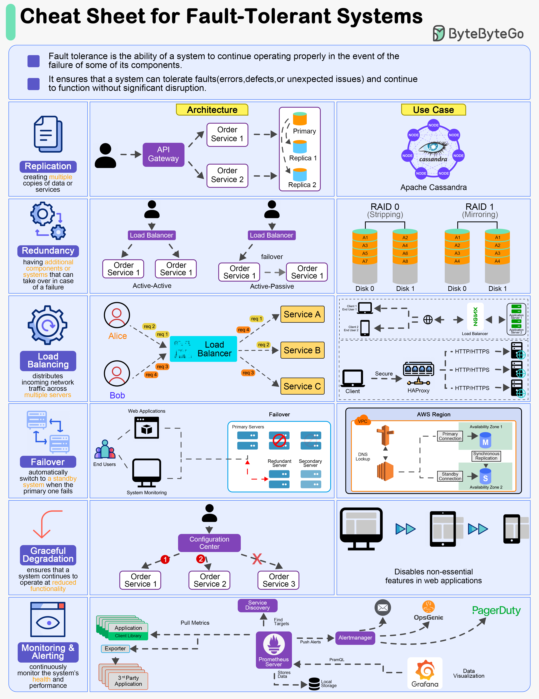

# 🛡️ 容错系统设计速查表！6大原则保障高可用

> 系统一定会出故障，关键是出了故障还能正常运行

设计容错系统是保障高可用和可靠性的关键。6大核心原则 👇

1️⃣ **复制（Replication）** — 在不同节点或位置创建数据和服务的多个副本

2️⃣ **冗余（Redundancy）** — 准备额外的组件或系统，主系统故障时自动接管

3️⃣ **负载均衡（Load Balancing）** — 分散流量到多台服务器，避免单点过载

4️⃣ **故障转移（Failover）** — 主系统故障时自动切换到备用系统

5️⃣ **优雅降级（Graceful Degradation）** — 部分组件故障时降低功能而不是完全崩溃

6️⃣ **监控告警（Monitoring & Alerting）** — 持续监控系统健康状态，异常时及时告警

💡 容错设计的核心思想：假设一切都会出错，然后为每种故障准备应对方案。

---

#容错 #高可用 #系统设计 #架构师 #程序员 #后端开发 #技术干货
