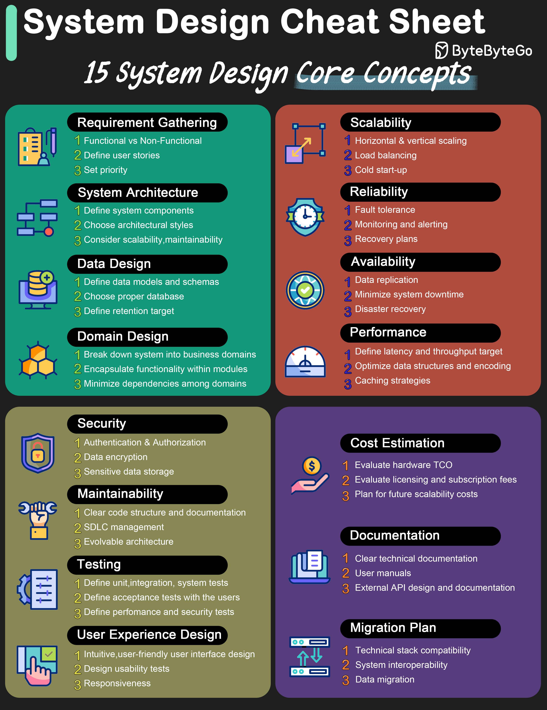

# 📋 系统设计速查表！15个核心概念一网打尽

> 系统设计面试前必看，收藏这一张图就够了

系统设计的15个核心概念，面试和工作都用得上 👇

1️⃣ 需求收集
2️⃣ 系统架构
3️⃣ 数据设计
4️⃣ 领域设计
5️⃣ 可扩展性
6️⃣ 可靠性
7️⃣ 可用性
8️⃣ 性能
9️⃣ 安全性
🔟 可维护性
1️⃣1️⃣ 测试
1️⃣2️⃣ 用户体验设计
1️⃣3️⃣ 成本估算
1️⃣4️⃣ 文档
1️⃣5️⃣ 迁移计划

💡 系统设计不只是画架构图，这15个维度都要考虑到。面试时按这个清单逐一展开，思路会非常清晰。

---

#系统设计 #面试 #架构师 #程序员 #技术干货 #后端开发
