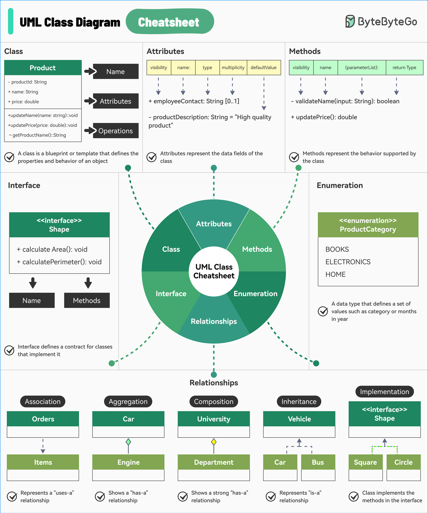

# 📐 UML类图速查表

> 画类图是架构师的基本功，这张速查表帮你快速上手

UML是可视化系统设计的标准方式，类图在业界广泛使用 👇

📌 **类（Class）** — 定义对象属性和行为的蓝图

📌 **属性（Attributes）** — 类的数据字段

📌 **方法（Methods）** — 类可以执行的行为

📌 **接口（Interface）** — 定义行为契约，实现类必须提供这些方法

📌 **枚举（Enumeration）** — 定义一组命名值的特殊数据类型（如产品类别、月份）

📌 **关系（Relationships）**
- 关联（Association）— 一般关系
- 聚合（Aggregation）— "有一个"，部分可独立存在
- 组合（Composition）— "有一个"，部分不能独立存在
- 继承（Inheritance）— "是一个"
- 实现（Implementation）— 实现接口

💡 画类图的关键是搞清楚类之间的关系类型，特别是聚合和组合的区别。

---

#UML #面向对象 #软件设计 #程序员 #架构师 #技术干货
