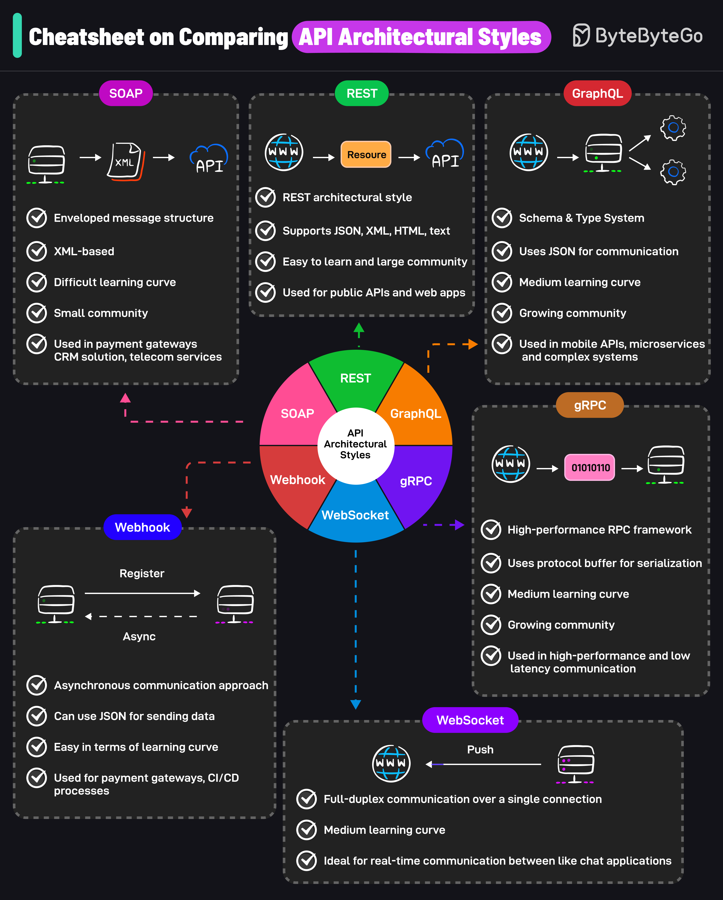

# 🔄 6种API架构风格对比速查表！选对风格事半功倍

> SOAP、REST、GraphQL、gRPC……到底该用哪个？

6种最流行的API架构风格，一图对比 👇

📌 **SOAP** — 基于XML的协议，企业级应用常用，安全性强但笨重

📌 **REST** — 最流行的API风格，基于HTTP，简单直观

📌 **GraphQL** — 客户端按需查询，避免过度获取数据

📌 **gRPC** — Google开发，基于Protocol Buffers，高性能，适合微服务间通信

📌 **WebSocket** — 全双工通信，适合实时场景（聊天、游戏）

📌 **Webhook** — 事件驱动，服务端主动推送通知

💡 选择建议：
- 对外API → REST
- 复杂查询 → GraphQL
- 微服务内部 → gRPC
- 实时通信 → WebSocket
- 事件通知 → Webhook

---

#API #REST #GraphQL #gRPC #程序员 #后端开发 #技术干货
