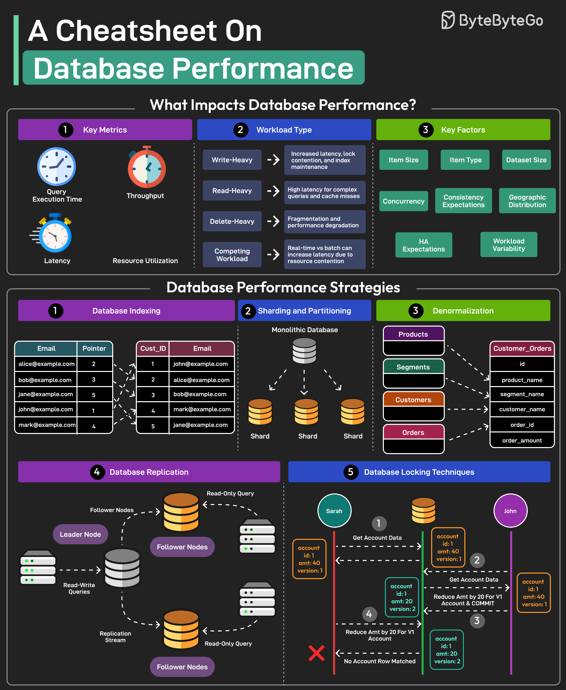

# ⚡ 数据库性能优化速查表！10招搞定慢查询

> 数据库慢了别慌，按这个清单逐一排查

数据库性能优化的10个关键策略 👇

1️⃣ **索引** — 加速查询，但过多索引会拖慢写入

2️⃣ **查询优化** — 用EXPLAIN分析执行计划，避免SELECT *

3️⃣ **连接池** — 减少建立新连接的开销，提升响应速度

4️⃣ **缓存** — 应用层（Redis/Memcached）+ 数据库层（查询缓存）

5️⃣ **分片** — 数据分布到多个数据库，处理大数据集

6️⃣ **复制** — 主从/主主复制，读扩展+高可用

7️⃣ **硬件** — 足够的内存、SSD存储、充足的CPU

8️⃣ **监控** — 关注查询响应时间、CPU使用率、磁盘I/O

9️⃣ **范式化/反范式化** — 范式化减冗余，反范式化提升读性能

🔟 **分区** — 水平/垂直分区，提升查询性能和数据管理

💡 优化顺序：先看慢查询日志 → 加索引 → 上缓存 → 考虑分片。80%的问题在前两步就能解决。

---

#数据库 #MySQL #PostgreSQL #性能优化 #程序员 #后端开发 #技术干货
