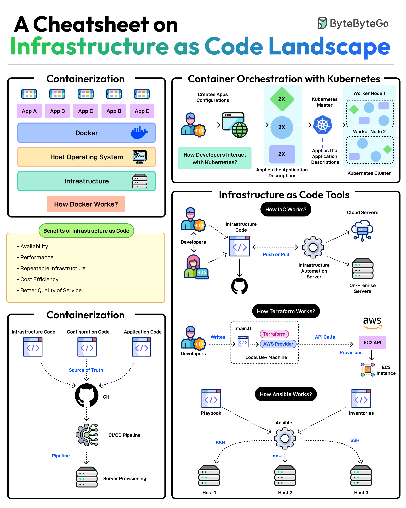

# 🏗️ 基础设施即代码(IaC)全景速查表！

> 用代码管理基础设施，告别手动运维

用代码管理基础设施是实现可扩展运维的关键。几种核心策略 👇

📦 **容器化（Containerization）**
Docker是最流行的容器化方案，把应用打包成可移植的容器

🎯 **容器编排（Container Orchestration）**
多容器场景下，Kubernetes成为必需品，管理容器的部署和扩展

📝 **基础设施即代码（IaC）**
用代码定义基础设施，可版本控制、可测试、可复用：
- Terraform — 多云基础设施管理
- AWS CloudFormation — AWS专用
- Ansible — 配置管理工具

🔄 **GitOps**
用Git工作流 + CI/CD自动化基础设施和配置更新

💡 IaC的好处：可用性、可扩展性、可重复性、成本效益。手动运维的时代已经过去了。

---

#IaC #DevOps #Terraform #Docker #Kubernetes #程序员 #运维 #技术干货
