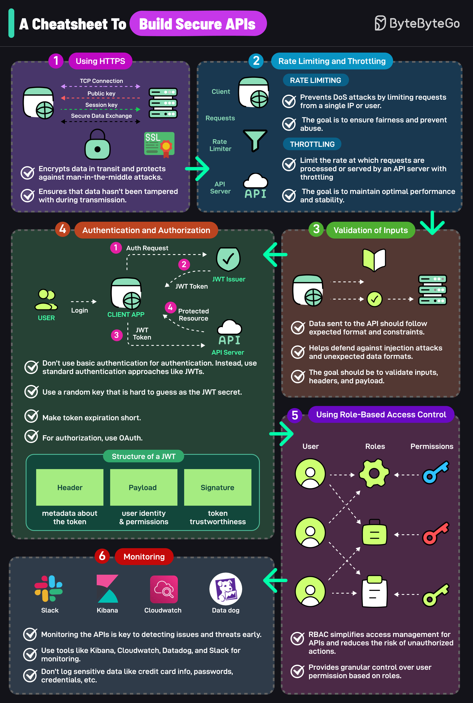

# 🔒 构建安全API的速查表

> 不安全的API会让整个应用暴露在风险中

一个不安全的API可能危及整个应用。这6个策略帮你降低风险 👇

1️⃣ **使用HTTPS** — 加密传输数据，防止中间人攻击，确保数据完整性

2️⃣ **限流和节流** — 限制单个IP/用户的请求频率，防止DoS攻击

3️⃣ **输入验证** — 验证请求头、输入和载荷，防御注入攻击

4️⃣ **认证和授权**
- 别用Basic Auth
- 用JWT做认证（密钥要复杂，过期时间要短）
- 用OAuth做授权

5️⃣ **基于角色的访问控制(RBAC)** — 按角色精细控制权限，降低越权风险

6️⃣ **监控** — 用Kibana、Datadog等工具监控API，不要记录敏感数据（密码、信用卡等）

💡 API安全不是事后补救，而是设计阶段就要考虑的事。

---

#API安全 #网络安全 #后端开发 #程序员 #技术干货 #系统设计
