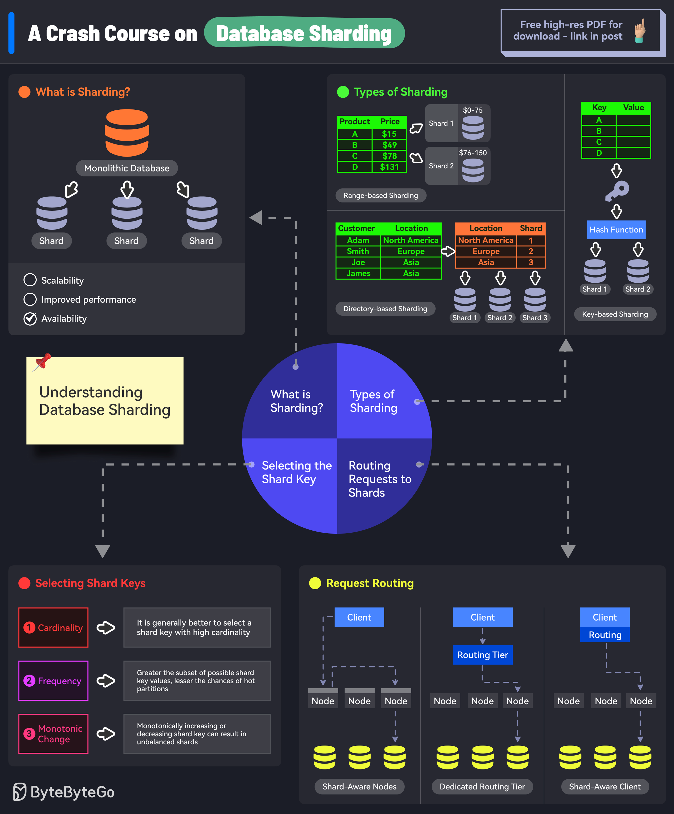

# 🔪 数据库分片速成课

> 数据量太大一台机器扛不住？分片来救场

数据库分片是把超大数据库拆成更小、更快、更易管理的部分 👇

🔑 **为什么要分片？**
- 单机数据量太大
- 单机请求太多
- 数据增长导致查询延迟升高

🔑 **分片键（Sharding Key）**
决定数据如何分布的列，选对分片键是成功的一半

🔑 **分片算法**
📌 范围分片 — 按ID范围分（1-1000在分片1，1001-2000在分片2）
📌 哈希分片 — hash(key) % 分片数，分布更均匀
📌 目录分片 — 用查找表映射分片位置

🔑 **分片方式**
- 应用层分片 — 应用自己决定用哪个分片
- 中间件分片 — 中间层处理分片逻辑
- 数据库原生分片 — 数据库自带分片能力

⚠️ **分片的挑战**
- 复杂度增加
- 跨分片JOIN和事务困难
- 重新分片很痛苦

💡 分片是最后的手段，先试索引、缓存、读写分离。真到了分片这步，选好分片键比什么都重要。

---

#数据库 #分片 #系统设计 #后端开发 #程序员 #技术干货 #架构
