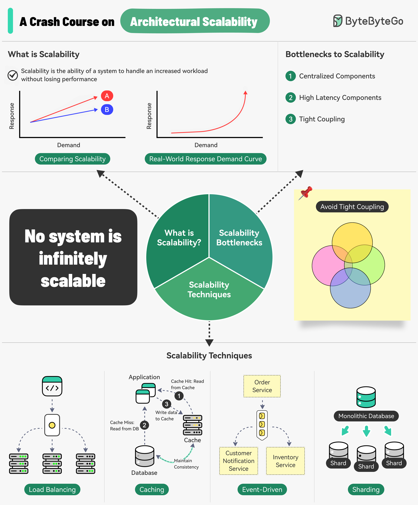

# 📈 架构可扩展性速成课

> 系统扩展不了？先找到瓶颈在哪

可扩展性 = 系统在负载增加时不丢性能的能力 👇

⚠️ **三大扩展瓶颈**
1. 中心化组件 — 容易成为单点故障
2. 高延迟组件 — 执行耗时操作的组件
3. 紧耦合 — 组件难以独立扩展

✅ **扩展原则**
- 无状态
- 松耦合
- 异步处理

🛠️ **四大扩展技巧**
📌 负载均衡 — 分散请求，避免单服务器瓶颈
📌 缓存 — 热点数据存内存
📌 事件驱动处理 — 异步处理耗时任务
📌 分片 — 大数据集拆分成小子集

💡 可扩展性不只是技术问题，还要考虑成本。如果扩展策略在经济上不可行，系统就很难继续扩展。

---

#可扩展性 #系统设计 #架构师 #程序员 #后端开发 #技术干货
