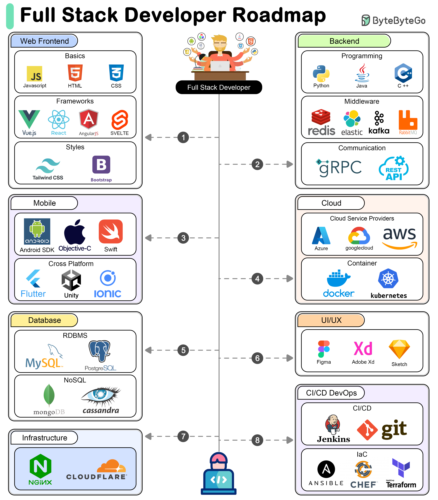

# 🗺️ 全栈开发路线图！7大技术栈全覆盖

> 想成为全栈工程师？这份路线图帮你规划方向

全栈开发者需要掌握多个领域的技术。7大技术栈一览 👇

1️⃣ **前端开发** — 用户界面和用户体验（HTML/CSS/JS/React/Vue）

2️⃣ **后端开发** — 服务端逻辑、数据库和服务集成（Node.js/Java/Python/Go）

3️⃣ **数据库开发** — 数据存储、检索和操作（MySQL/PostgreSQL/MongoDB/Redis）

4️⃣ **移动开发** — 移动应用开发（React Native/Flutter/Swift/Kotlin）

5️⃣ **云计算** — 云平台部署和管理（AWS/Azure/GCP）

6️⃣ **UI/UX设计** — 用户界面和体验设计（Figma/Sketch）

7️⃣ **基础设施和DevOps** — 基础设施管理、部署和CI/CD

💡 全栈不是要求每个领域都精通，而是前后端都能上手，有1-2个深入的方向。建议先精通前端或后端，再横向扩展。

---

#全栈开发 #程序员 #前端 #后端 #职业发展 #技术干货 #编程
