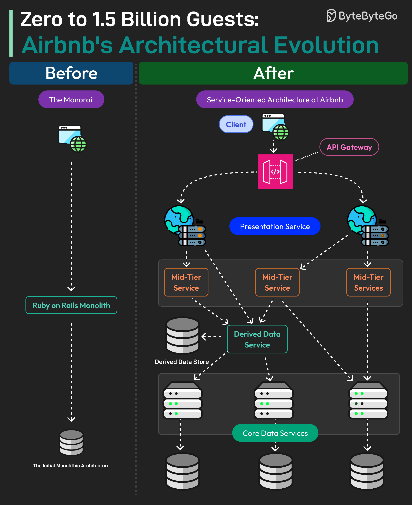

# 🏠 Airbnb架构进化史！从0到15亿用户的技术蜕变

> 从单体到SOA，Airbnb是怎么扛住超级增长的？

Airbnb覆盖200+国家，400万房东接待了超过15亿房客。背后的技术架构是怎么演进的？👇

📌 **起步：单体架构（Monorail）**
- Ruby on Rails构建
- 单层架构，前后端一体
- 创业初期够用

📌 **问题：超级增长带来的痛**
- 随着业务爆发式增长，单体架构开始扛不住

📌 **迁移：面向服务架构（SOA）**
客户端 → 网关 → 多个服务 + 数据库

服务分为4层：
1️⃣ **数据服务** — 底层，所有数据读写的入口
2️⃣ **派生数据服务** — 从数据服务读取，加上基础业务逻辑
3️⃣ **中间层服务** — 管理复杂业务逻辑
4️⃣ **展示服务** — 聚合所有服务的数据，加上前端业务逻辑

迁移完成后，单体被彻底淘汰，所有读写迁移到新服务。

💡 Airbnb的经验：不是一开始就用微服务，而是在单体扛不住时才迁移。架构要跟着业务走。

---

#Airbnb #系统架构 #微服务 #程序员 #技术干货 #大厂案例 #后端开发
