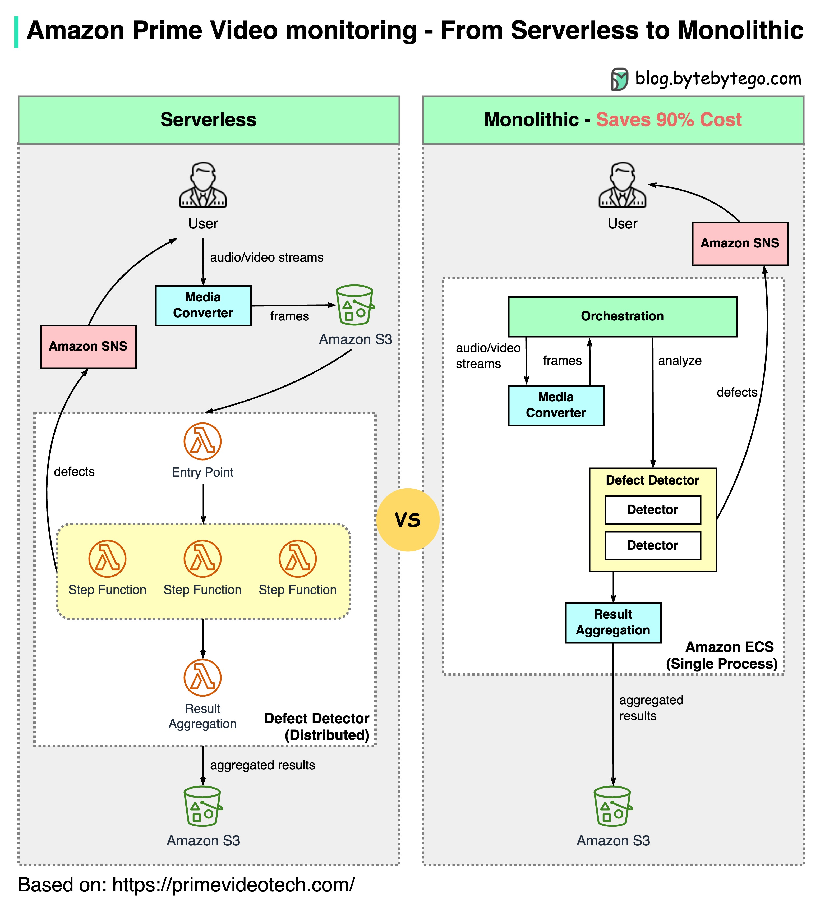

# 🎬 Amazon Prime Video从微服务回归单体，省了90%成本！

> 微服务不是银弹，Amazon用实际案例证明了这一点

Amazon Prime Video的监控服务从Serverless迁移到单体架构，成本直降90%。怎么回事？👇

📌 **背景**
Prime Video需要实时监控数千个直播流的质量（画面损坏、视频卡顿、音画不同步等）

📌 **旧架构的问题（Serverless）**
基于AWS Lambda，快速搭建没问题，但大规模运行时成本爆炸：
- AWS Step Functions按状态转换收费，每秒多次转换太贵
- 组件间数据通过S3传递，下载量大时成本很高

📌 **新架构（单体）**
把媒体转换器和缺陷检测器部署在同一个进程中：
- 省去了网络传输数据的成本
- 结果：成本降低90%！

📌 **大佬怎么说？**
- AWS CTO Werner Vogels："构建可演进的软件系统是策略，不是信仰"
- 前Amazon VP Adrian Cockcroft："我提倡Serverless First，但不是Serverless Only"

💡 微服务不是万能的，架构选择要根据实际场景。有时候"退一步"反而是最优解。

---

#Amazon #微服务 #单体架构 #Serverless #程序员 #系统设计 #技术干货
