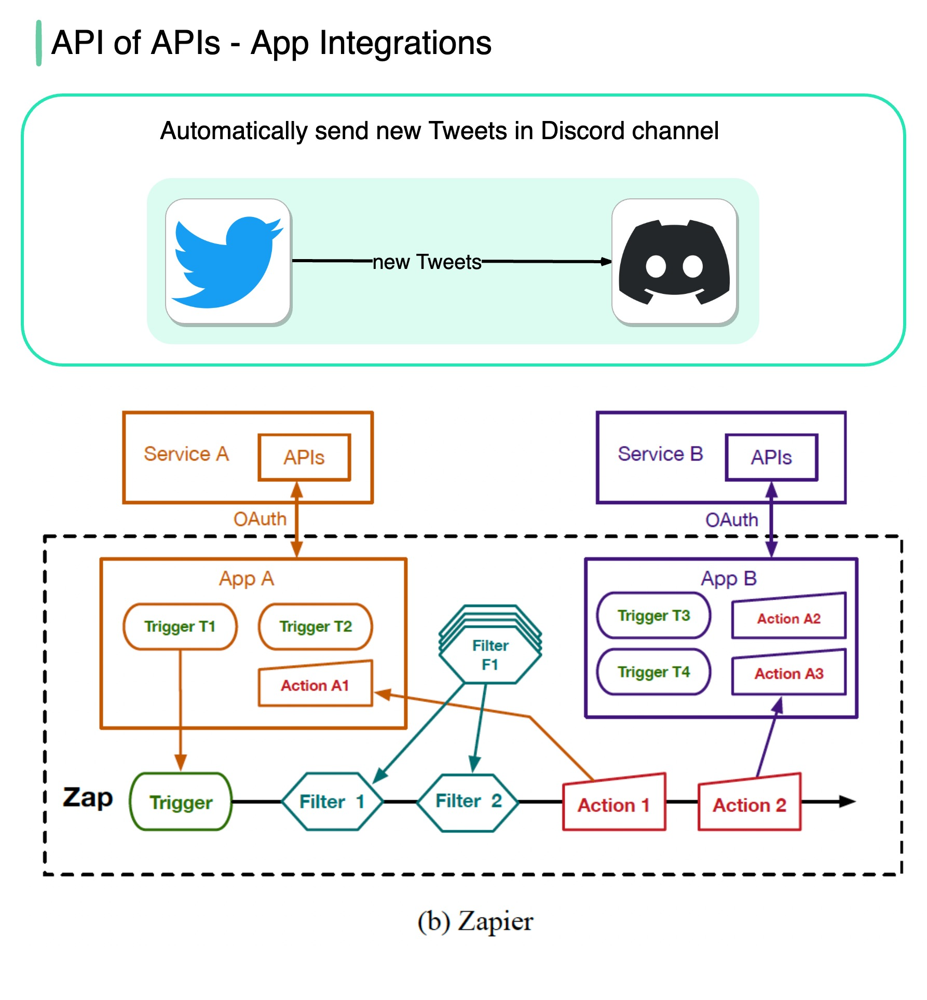

# 🔗 API的API！无代码工具如何实现应用集成

> Zapier、IFTTT这些工具背后的原理是什么？

Zapier、IFTTT等无代码工具让任何人都能通过可视化界面构建应用和自动化工作流 👇

📌 **核心原理**
这些工具本质上是"API的API"——它们封装了各种应用的API，让你通过拖拽就能连接不同服务

📌 **工作方式**
触发器（Trigger）→ 动作（Action）
- 当A应用发生某事时 → 自动在B应用执行某操作
- 例如：收到邮件 → 自动保存附件到云盘

💡 这类工具降低了技术门槛，让非程序员也能实现自动化。但复杂场景还是需要写代码。

---

#无代码 #自动化 #Zapier #API #效率工具 #程序员 #技术干货
