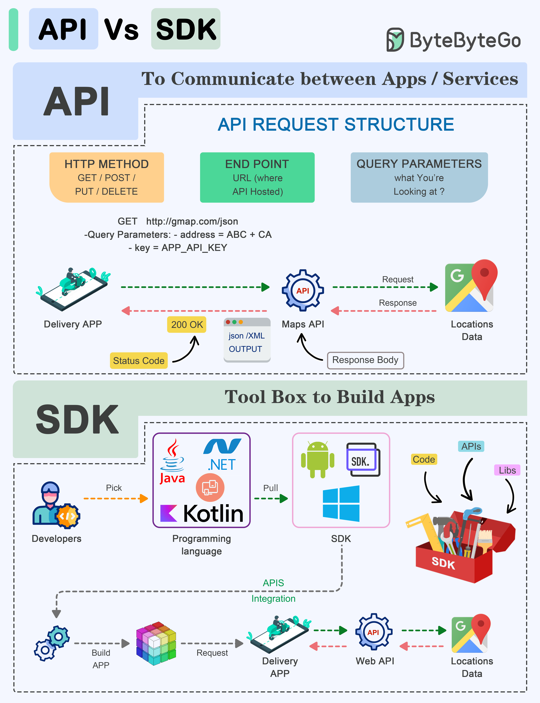

# 🆚 API vs SDK

> 都是开发工具，但用途完全不同

API和SDK是软件开发中的基础工具，但它们的定位不同 👇

📌 **API（应用程序编程接口）**
- 一组规则和协议，让不同软件互相通信
- 定义组件如何交互
- 由端点、请求和响应组成
- 类比：餐厅的菜单，告诉你能点什么

📌 **SDK（软件开发工具包）**
- 包含工具、库、示例代码和文档的完整包
- 提供更高层的抽象，简化特定平台的开发
- 针对特定平台优化，确保兼容性和性能
- 类比：整套厨具，帮你自己做菜

💡 简单理解：
- API = 通信协议（我怎么跟你说话）
- SDK = 开发工具箱（帮你更快地开发）
- SDK里通常包含API，但API不一定需要SDK

---

#API #SDK #程序员 #软件开发 #技术干货 #编程入门
