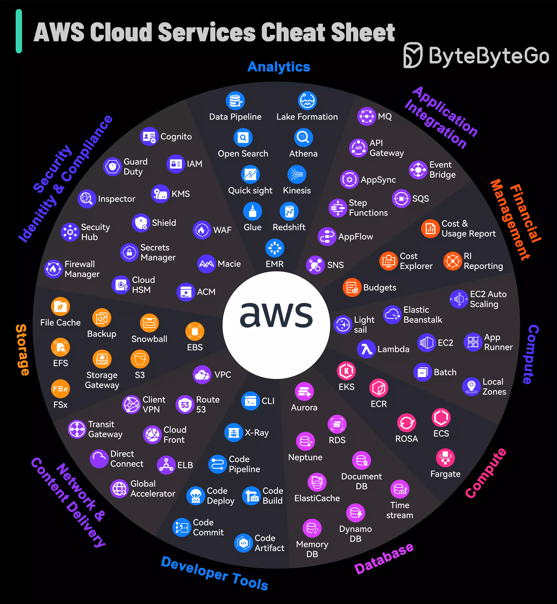

# ☁️ AWS服务速查表！一图看懂亚马逊云全家桶

> AWS服务太多记不住？这张图帮你理清

AWS从内部项目成长为云服务市场领导者，服务多到连专家都觉得眼花缭乱 👇

AWS不仅满足基础云需求，还在机器学习、IoT等前沿技术领域持续创新，提供安全、可扩展、高效运维的能力。

这张速查表覆盖了AWS的主要服务分类：
📌 计算 — EC2、Lambda、ECS
📌 存储 — S3、EBS、Glacier
📌 数据库 — RDS、DynamoDB、Aurora
📌 网络 — VPC、CloudFront、Route 53
📌 安全 — IAM、KMS、WAF
📌 AI/ML — SageMaker、Rekognition
📌 分析 — Redshift、Athena、EMR

💡 不需要全部掌握，根据你的业务场景选择对应的服务即可。收藏这张图，需要时查阅。

---

#AWS #云计算 #程序员 #后端开发 #技术干货 #DevOps #云服务
