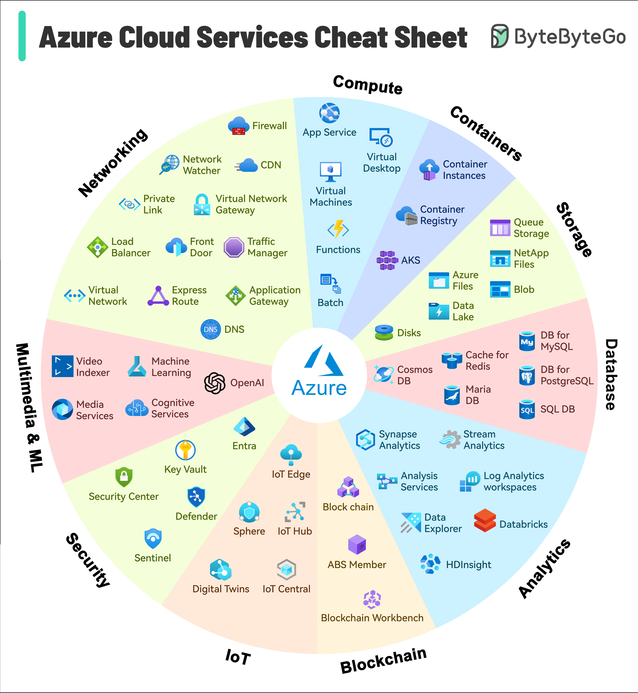

# ☁️ Azure服务速查表

> Azure市场份额第二，这些核心服务你该了解

微软Azure从2010年上线，迅速成长为市场份额第二的云平台 👇

Azure不仅支持传统云应用，还覆盖AI、IoT、区块链等新兴技术，是创新和开发的重要平台。

核心服务分类：
📌 计算 — Virtual Machines、App Service、Functions
📌 存储 — Blob Storage、Disk Storage
📌 数据库 — Cosmos DB、SQL Database
📌 网络 — Virtual Network、CDN、Load Balancer
📌 AI — Cognitive Services、Machine Learning
📌 DevOps — Azure DevOps、Container Instances

💡 如果你的公司用微软技术栈（.NET、Windows Server等），Azure是最自然的选择，集成度最高。

---

#Azure #微软 #云计算 #程序员 #技术干货 #云服务 #DevOps
