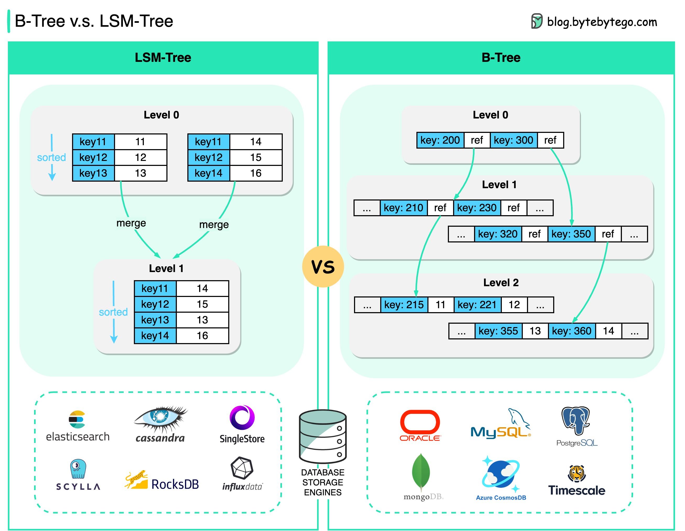

# 🌳 B-Tree vs LSM-Tree！数据库索引的两大流派

> 读多用B-Tree，写多用LSM-Tree，就这么简单

数据库索引的两大核心数据结构，各有所长 👇

📌 **B-Tree**
- 几乎所有关系型数据库都在用（MySQL、PostgreSQL）
- 基本存储单位是"页"
- 沿着键的范围向下查找直到找到目标值
- 优势：读取更快

📌 **LSM-Tree（日志结构合并树）**
- NoSQL数据库的最爱（Cassandra、LevelDB、RocksDB）
- 用SSTable（排序字符串表）持久化键值对
- Level 0段定期合并到Level 1（压缩过程）
- 优势：写入更快

🔑 **核心区别**
- B-Tree → 读快
- LSM-Tree → 写快

💡 选择建议：OLTP读多写少场景用B-Tree（MySQL），写密集场景用LSM-Tree（Cassandra）。

---

#数据库 #数据结构 #MySQL #Cassandra #程序员 #技术干货 #后端开发
