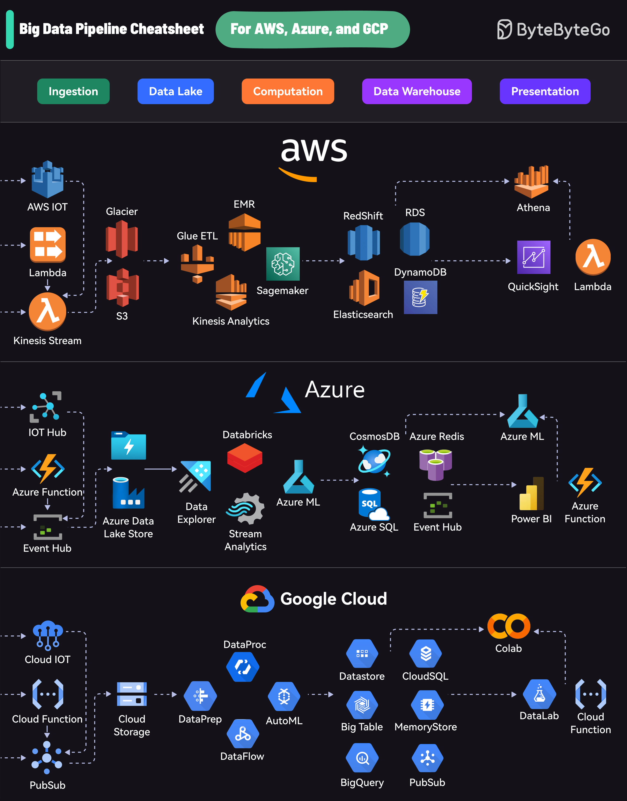

# 📊 三大云平台大数据管道速查表！AWS vs Azure vs GCP

> 同样的数据处理流程，三家云的方案对比

大数据管道的5个阶段，三大云平台各自的方案 👇

| 阶段 | AWS | Azure | GCP |
|------|-----|-------|-----|
| 📥 数据采集 | Kinesis | Event Hubs | Pub/Sub |
| 🗄️ 数据湖 | S3 | Data Lake Store | Cloud Storage |
| ⚡ 计算处理 | EMR | Databricks | DataProc/DataFlow |
| 🏢 数据仓库 | Redshift | Cosmos DB | BigQuery |
| 📈 可视化 | QuickSight | Power BI | Data Studio |

💡 选择建议：
- 已有AWS基础设施 → 用AWS全家桶
- 微软技术栈 → Azure + Power BI
- 数据分析为主 → GCP BigQuery性价比最高

---

#大数据 #AWS #Azure #GCP #云计算 #程序员 #数据工程 #技术干货
