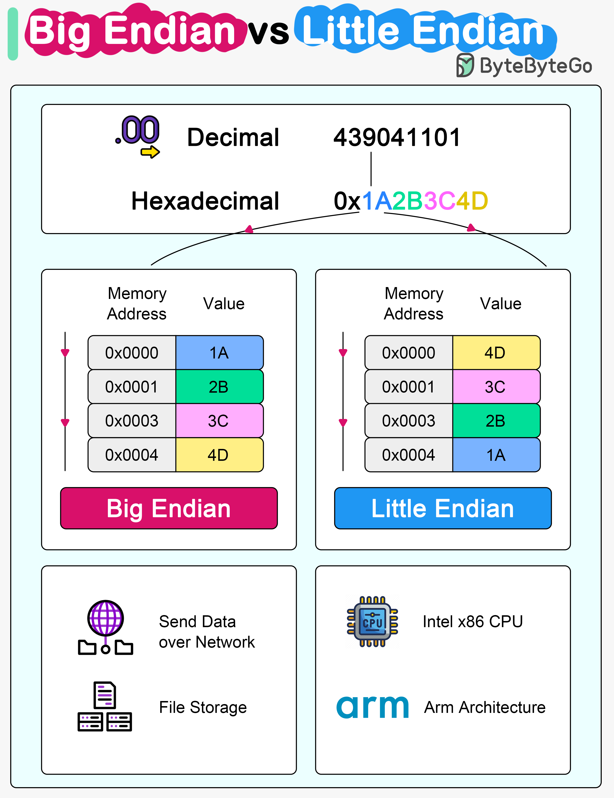

# 🔄 大端序 vs 小端序！字节序到底是什么？

> 跨系统传数据时踩过坑的人都懂这个痛

处理器存储多字节数据时有两种方式，这就是"字节序" 👇

📌 **小端序（Little Endian）**
- 最低有效字节存在最低地址
- Intel x86处理器使用
- 大多数现代PC都是小端序

📌 **大端序（Big Endian）**
- 最高有效字节存在最低地址
- 老的PowerPC和Motorola 68k使用
- 网络通信和文件存储通常用大端序

⚠️ **为什么重要？**
当数据在不同字节序的系统间传输时，如果不正确处理字节序，数据就会被错误解读。

💡 记忆技巧：网络传输用大端序（Network Byte Order），所以跨网络传数据时要注意转换。

---

#计算机基础 #字节序 #网络编程 #程序员 #技术干货 #底层原理
