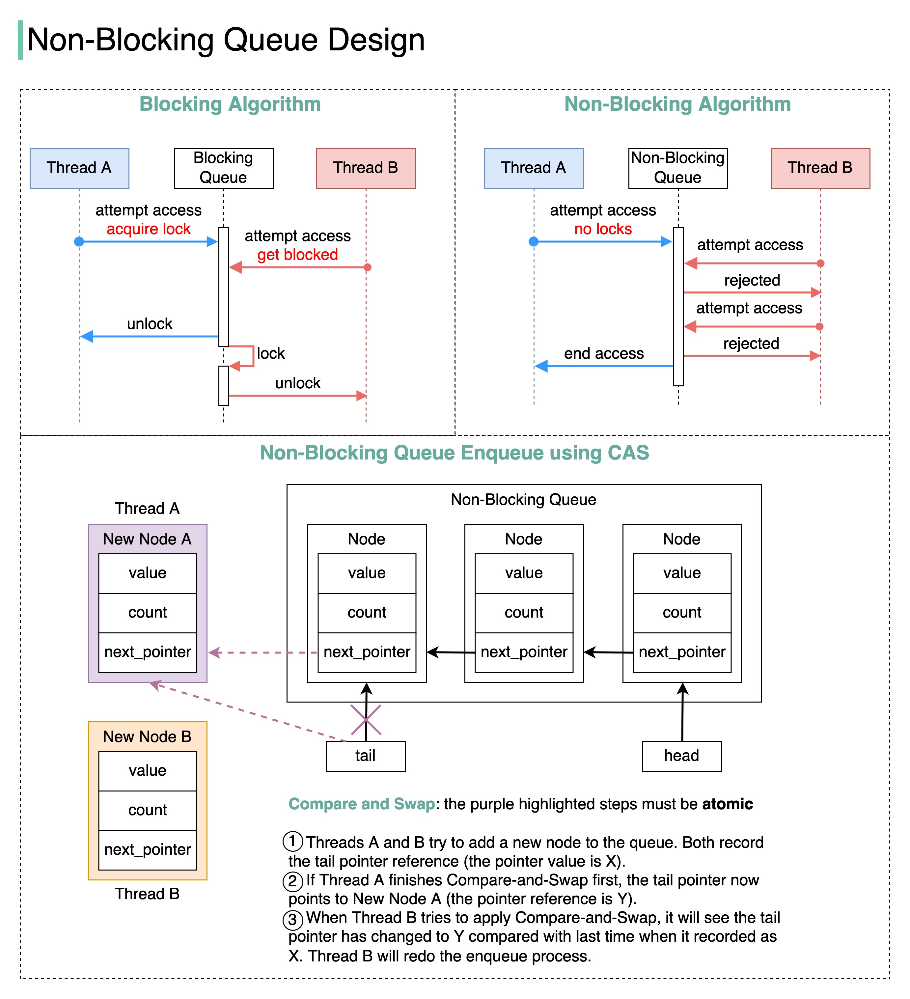

# ⏳ 阻塞队列 vs 非阻塞队列

> 搞懂这个，并发编程就入门了一半

并发编程中最容易混淆的概念之一，一次讲清楚 👇

📌 **阻塞（Blocking）**
- 使用锁机制
- 线程A持有锁时，线程B必须等待
- 如果A被挂起，B可能等很久甚至饿死

📌 **非阻塞（Non-Blocking）**
- 线程A必须在有限步骤内完成任务
- 线程B被拒绝时立即得到通知，不会傻等

📌 **无饥饿（Starvation-free）**
- 线程不会因为一直拿不到资源而无法继续

📌 **无等待（Wait-free）**
- 所有线程都能在有限步骤内完成任务
- Wait-free = Non-Blocking + Starvation-free

🛠️ **非阻塞队列实现**
用CAS（Compare and Swap）实现，好处：
1. 线程不会被挂起，延迟大幅降低
2. 不会死锁

💡 高并发场景优先考虑非阻塞算法，但实现复杂度更高。

---

#并发编程 #多线程 #程序员 #Java #技术干货 #计算机基础
