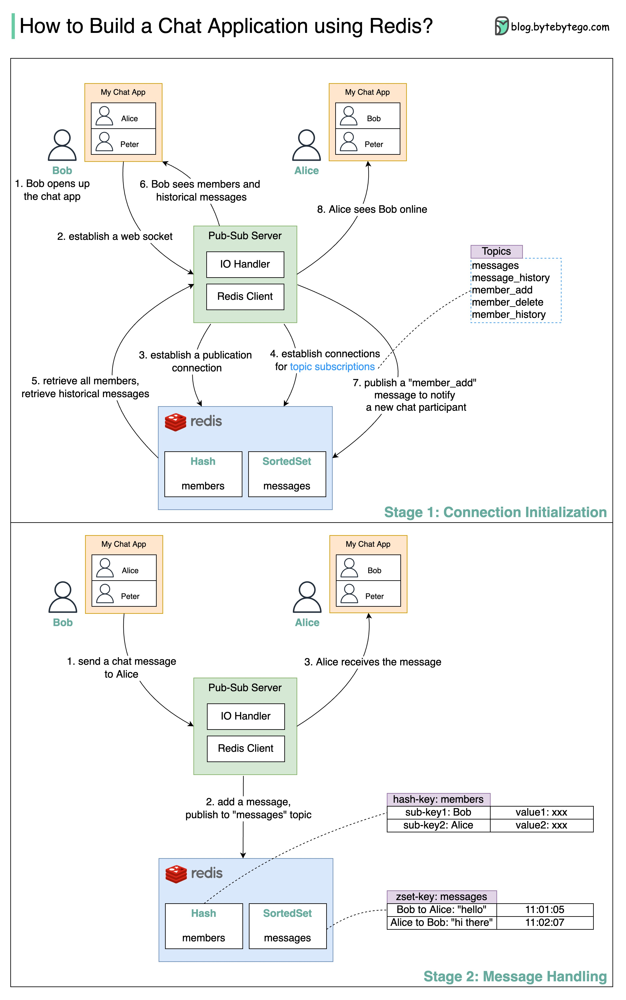

# 💬 用Redis搭建简易聊天应用！Pub/Sub实战

> Redis不只是缓存，还能做实时消息系统

用Redis的发布/订阅功能搭建聊天应用，分两个阶段 👇

📌 **阶段一：连接初始化**
1. Bob打开聊天应用，建立WebSocket连接
2. Pub/Sub服务器与Redis建立多个连接（发布+订阅）
3. 从Redis获取聊天成员列表和历史消息
4. Bob加入时发布消息到"member_add"主题，其他人看到Bob上线

📌 **阶段二：消息处理**
1. Bob发消息给Alice
2. 消息用zadd写入Redis SortedSet（按时间排序），同时发布到"messages"主题
3. Alice的客户端收到Bob的消息

🔑 **用到的Redis特性**
- Pub/Sub — 实时消息推送
- SortedSet — 按时间排序存储消息
- WebSocket — 全双工实时通信

💡 这是一个简化版架构，生产环境还需要考虑消息持久化、离线消息、消息确认等。

---

#Redis #聊天应用 #WebSocket #后端开发 #程序员 #技术干货
