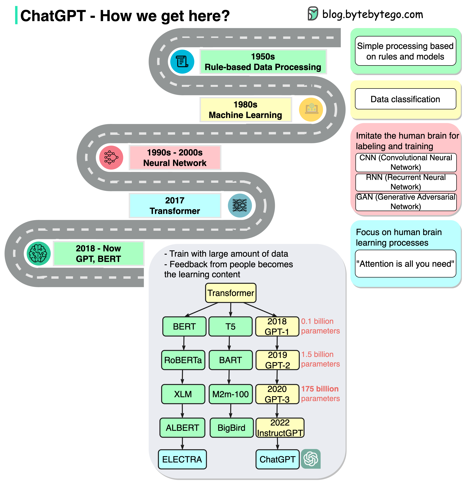

# 🤖 ChatGPT进化时间线

> ChatGPT不是凭空出现的，背后是几十年的研究积累

ChatGPT看似横空出世，实际上建立在几十年的研究基础上 👇

📌 **1950s** — 基于规则的原始模型

📌 **1980s** — 机器学习兴起，用于分类任务，小规模数据训练

📌 **1990s-2000s** — 神经网络模拟人脑：
- CNN（卷积神经网络）— 视觉任务
- RNN（循环神经网络）— 自然语言任务
- GAN（生成对抗网络）— 生成逼真图像

📌 **2017** — "Attention Is All You Need"论文发表，Transformer模型诞生，通过并行化大幅缩短训练时间，奠定生成式AI基础

📌 **2018至今** — Transformer推动大模型爆发，在海量数据上训练，能写文章、新闻、技术文档甚至代码，商业价值巨大，掀起全球AI浪潮

💡 AI的发展不是一蹴而就的，每一次突破都建立在前人的基础上。Transformer是当前这波AI革命的关键转折点。

---

#ChatGPT #AI #人工智能 #Transformer #程序员 #技术干货 #深度学习
