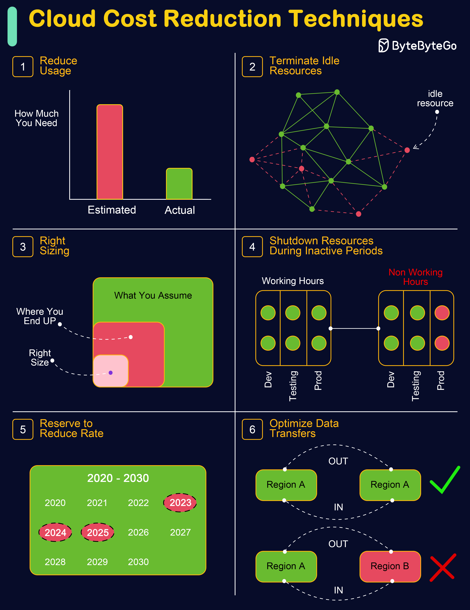

# 💰 云成本优化6大技巧

> 上云容易省钱难，这6招帮你砍掉不必要的开支

云成本失控是很多企业面临的挑战。6个实用的降本技巧 👇

1️⃣ **减少用量** — 精细调整资源规模，缩小实例、减少存储、合并服务

2️⃣ **关闭闲置资源** — 找到并删除不活跃的实例、数据库和存储

3️⃣ **合理选型（Right Sizing）** — 调整实例大小，既不浪费也不不足

4️⃣ **非高峰时段关机** — 设置自动化机制，低活跃期关闭非必要资源

5️⃣ **预留实例降费率** — 用Reserved Instances或Savings Plans，还可以考虑Spot实例和低级别存储

6️⃣ **优化数据传输** — 数据压缩、CDN减少带宽费用，资源就近部署减少跨区传输

💡 云成本优化不是一次性的事，需要持续监控和调整。建议设置成本告警，定期review账单。

---

#云计算 #成本优化 #AWS #DevOps #程序员 #技术干货
