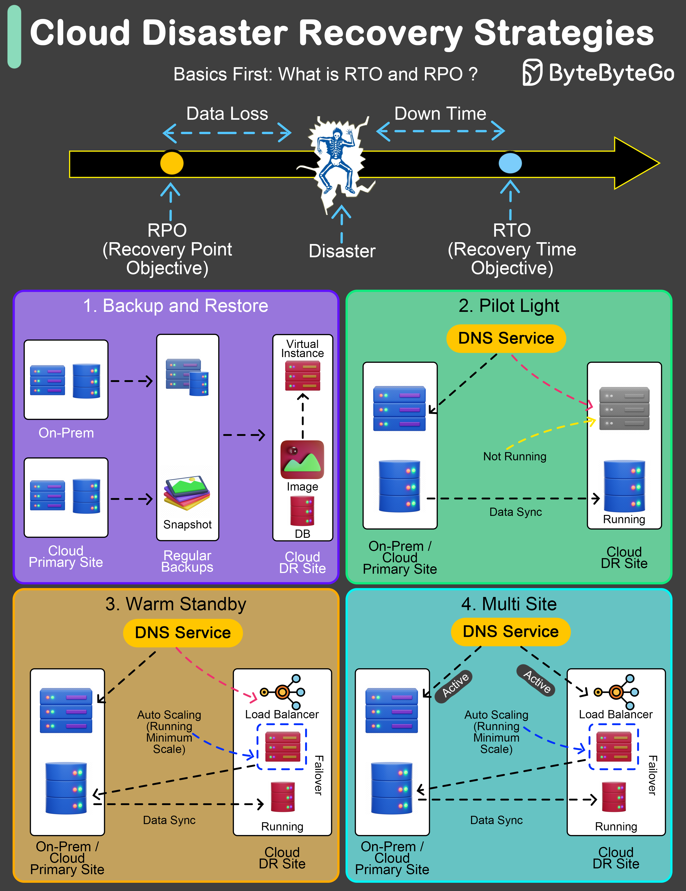

# 🆘 云灾难恢复4大策略！从几天恢复到几秒恢复

> 灾难恢复不是可选项，是必需品

有效的灾难恢复计划是必需品。两个关键指标 👇

📌 **RTO（恢复时间目标）** — 系统最多能停多久
📌 **RPO（恢复点目标）** — 最多能丢多少数据

4种策略，从便宜到贵：

1️⃣ **备份恢复** — RTO：数小时到数天 | RPO：到上次备份
最便宜，但恢复最慢

2️⃣ **灯塔模式（Pilot Light）** — RTO：分钟到小时 | RPO：取决于同步频率
关键组件保持就绪状态，灾难时快速扩展

3️⃣ **温备（Warm Standby）** — RTO：分钟到小时 | RPO：分钟到小时
半活跃环境，数据保持同步

4️⃣ **热备/多站点** — RTO：几乎即时 | RPO：几秒
完全运行的镜像环境，成本最高但恢复最快

💡 选择策略取决于你的业务能承受多长时间的停机和多少数据丢失。金融系统用热备，内部工具用备份恢复就够了。

---

#灾难恢复 #云计算 #高可用 #系统设计 #程序员 #技术干货
