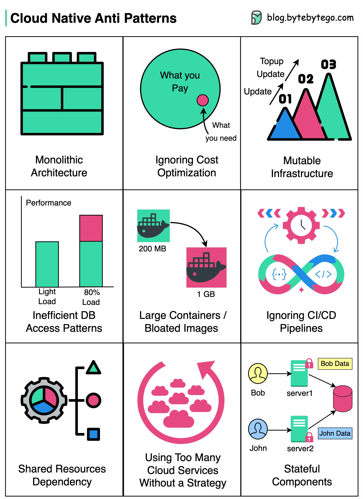

# ❌ 云原生9大反模式！这些坑你踩过几个？

> 知道什么不该做，比知道该做什么更重要

上云不等于云原生，这9个反模式要避免 👇

1️⃣ **单体架构上云** — 把大单体直接搬到云上，无法发挥云的弹性优势

2️⃣ **忽视成本优化** — 云服务很贵，不优化成本会预算超支

3️⃣ **可变基础设施** — 基础设施应该是一次性的，不要原地修改，否则配置漂移

4️⃣ **低效数据库访问** — 复杂查询+缺少索引=性能瓶颈

5️⃣ **臃肿的容器镜像** — 大镜像部署慢、占资源多、扩展慢

6️⃣ **忽视CI/CD** — 手动部署容易出错，影响发布频率

7️⃣ **共享资源依赖** — 多应用共享数据库会产生竞争和瓶颈

8️⃣ **无策略地使用太多云服务** — 服务太多没有规划会增加复杂度

9️⃣ **有状态组件** — 依赖持久状态会增加复杂度，限制扩展和容错

💡 云原生的核心：无状态、不可变基础设施、自动化一切。

---

#云原生 #DevOps #反模式 #程序员 #架构 #技术干货 #Kubernetes
