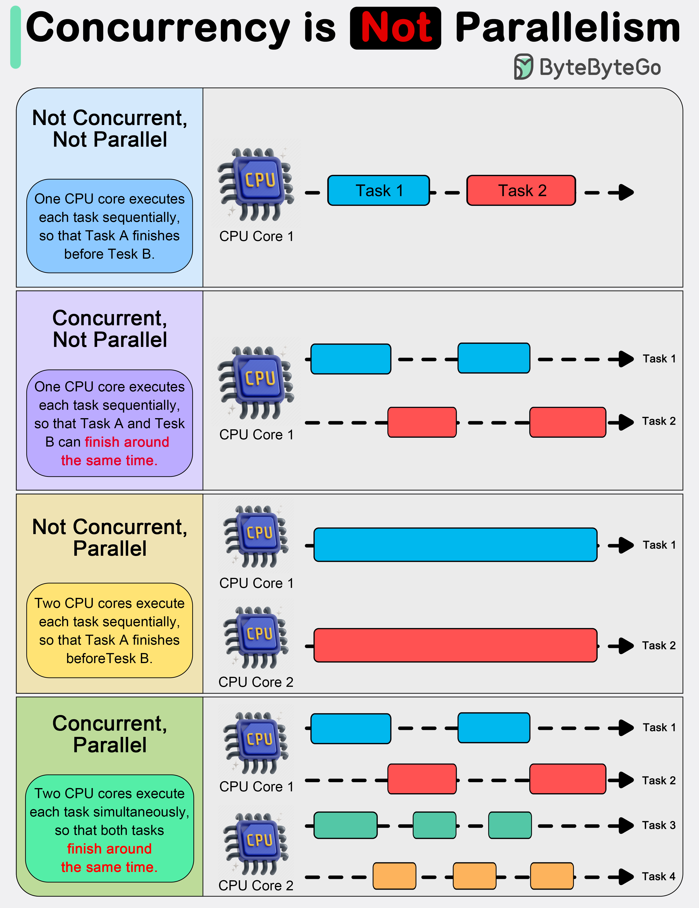

# 🔀 并发≠并行！一次搞清这两个概念

> Go语言之父Rob Pike说：并发是处理，并行是执行

并发和并行经常被混淆，但它们是完全不同的概念 👇

📌 **并发（Concurrency）**
- 同时处理多件事的能力
- 关注程序的设计和结构
- 单核CPU也能实现并发
- 适合I/O密集型任务（文件、网络、用户交互）

📌 **并行（Parallelism）**
- 同时执行多个计算
- 关注程序的执行
- 需要多核/多处理器硬件
- 适合CPU密集型任务（数学计算、图像处理、数据分析）

🔑 **Rob Pike的经典总结**
"并发是同时处理很多事情，并行是同时做很多事情"

💡 简单类比：一个人同时处理多个任务（切换做）是并发，多个人同时各做一个任务是并行。

---

#并发 #并行 #编程 #Go #程序员 #计算机基础 #技术干货
