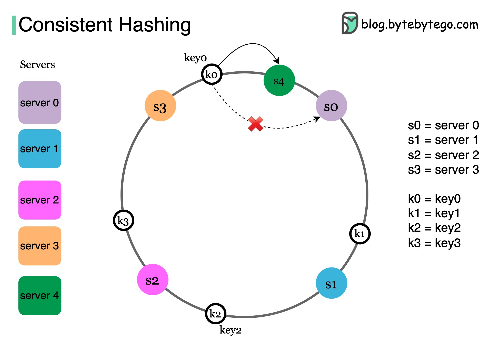

# 🔄 一致性哈希详解！DynamoDB、Cassandra都在用

> 分布式系统中最优雅的数据分布算法

Amazon DynamoDB、Apache Cassandra、Discord、Akamai CDN有什么共同点？都用一致性哈希 👇

⚠️ **简单哈希的问题**
serverIndex = hash(key) % N
当服务器数量N变化时（扩容/缩容），几乎所有数据都要重新分配，引发"缓存雪崩"

✅ **一致性哈希的解决方案**
- 把服务器和数据都映射到一个环上
- 数据顺时针找到的第一个服务器就是它的归属
- 新增/删除服务器时，只有少量数据需要迁移

📌 **实际应用**
- DynamoDB/Cassandra — 重新平衡时最小化数据迁移
- Akamai CDN — 均匀分发内容到边缘服务器
- Google负载均衡 — 均匀分配持久连接

💡 一致性哈希是分布式系统面试的高频考点，理解原理和应用场景很重要。

---

#一致性哈希 #分布式系统 #系统设计 #面试 #程序员 #技术干货
