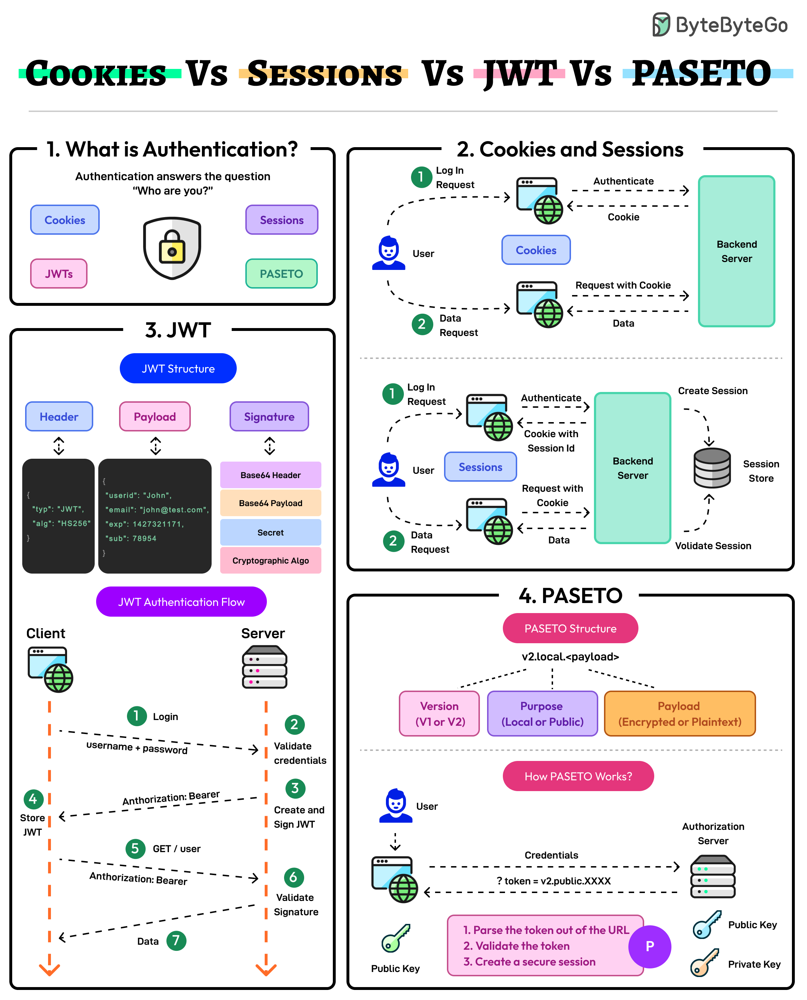

# 🔐 Cookie vs Session vs JWT vs PASETO！认证方案大对比

> 四种认证方式各有优劣，选对很重要

现代认证有多种方案，来看看它们的区别 👇

📌 **Cookie + Session**
- 会话数据存服务端，客户端只存Cookie引用
- 适合需要严格服务端控制的场景
- 缺点：分布式系统中扩展性差

📌 **JWT（JSON Web Token）**
- 无状态，所有用户数据都在Token里
- 高度可扩展
- 缺点：需要小心处理Token被盗和过期问题

📌 **PASETO（平台无关安全令牌）**
- JWT的改进版，更强的加密默认值
- 消除了算法选择漏洞
- 避免了JWT配置错误的风险

💡 选择建议：
- 传统Web应用 → Cookie + Session
- 微服务/移动端 → JWT
- 安全要求极高 → PASETO

---

#认证 #安全 #JWT #Cookie #程序员 #后端开发 #技术干货
