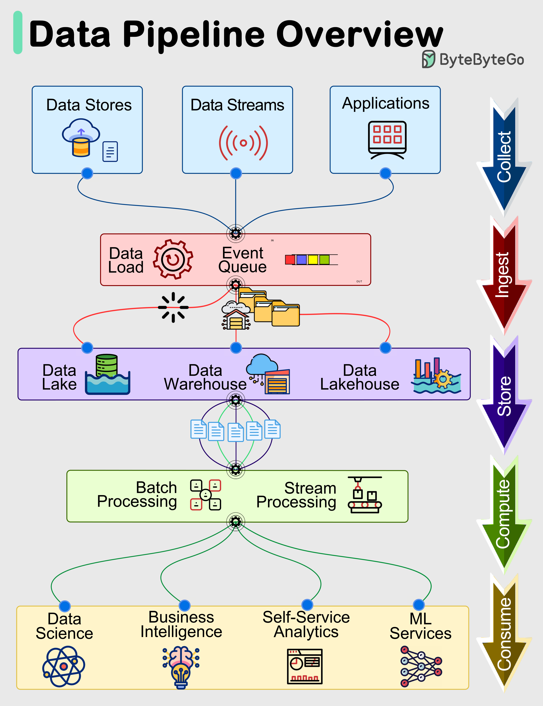

# 📊 数据管道全景概览

> 从数据采集到消费，完整的数据管道长这样

数据管道是现代数据系统的核心，通常包含5个阶段 👇

1️⃣ **采集（Collect）** — 从数据存储、数据流和应用中获取数据

2️⃣ **摄入（Ingest）** — 将数据加载到系统中，在事件队列中组织

3️⃣ **存储（Store）** — 存入数据仓库、数据湖或数据湖仓

4️⃣ **计算（Compute）** — 数据聚合、清洗、转换，包括格式转换、压缩、分区等。使用批处理和流处理技术

5️⃣ **消费（Consume）** — 处理后的数据供分析工具、仪表盘、机器学习服务、BI等使用

💡 每个阶段的效率和有效性决定了整个数据驱动运营的成功。理解这5个阶段是数据工程入门的第一步。

---

#数据管道 #数据工程 #大数据 #程序员 #技术干货 #数据分析
