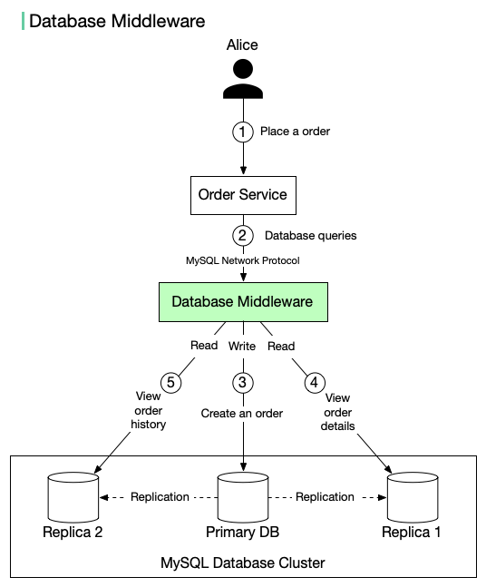

# 🔀 数据库中间件！读写分离的透明代理方案

> 应用不用关心数据库拓扑，中间件帮你搞定路由

读写分离有两种实现方式，数据库中间件是其中更优雅的一种 👇

📌 **工作原理**
1. 应用发送查询到中间件（而非直接连数据库）
2. 中间件将写操作路由到主库
3. 数据复制到从库
4. 读操作路由到从库

✅ **优点**
- 应用代码简化，不需要感知数据库拓扑
- 兼容性好，使用MySQL标准协议，迁移方便

❌ **缺点**
- 系统复杂度增加，中间件本身需要高可用
- 多一层网络延迟，对性能要求高

💡 中间件方案适合大型系统，小项目直接在应用层做路由更简单。

---

#数据库 #读写分离 #MySQL #后端开发 #程序员 #系统设计 #技术干货
