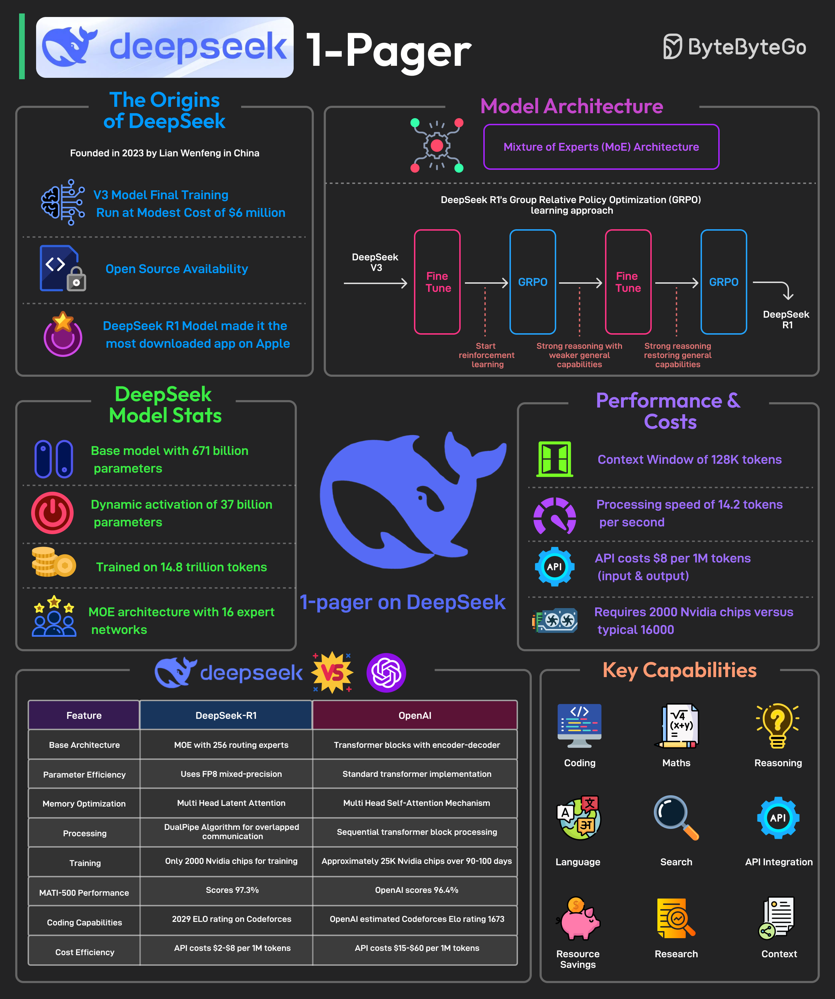

# 🧠 DeepSeek一页纸速览

> 用2000张GPU训出媲美GPT-4的模型，DeepSeek做到了

DeepSeek以极低成本开发出强大AI模型，2025年1月发布R1推理模型，登顶App Store 👇

📌 **核心数据**
- 最终训练成本约600万美元
- 671亿总参数，每个任务只激活37亿（MoE架构）
- 在14.8万亿token、52种语言上预训练
- 仅用2000张Nvidia GPU（GPT-4用了约25000张）
- 成本比竞品低85-90%

📌 **技术创新**
- 使用GRPO（组相对策略优化）强化学习技术
- 不依赖大量人工标注数据
- 通过比较同一上下文中的多个可能答案来提升推理效率

📌 **擅长领域**
- 数学、编程、推理任务
- MIT开源许可证发布

💡 DeepSeek证明了：AI不一定要烧钱，聪明的架构设计和训练策略同样重要。

---

#DeepSeek #AI #人工智能 #大模型 #开源 #程序员 #技术干货
