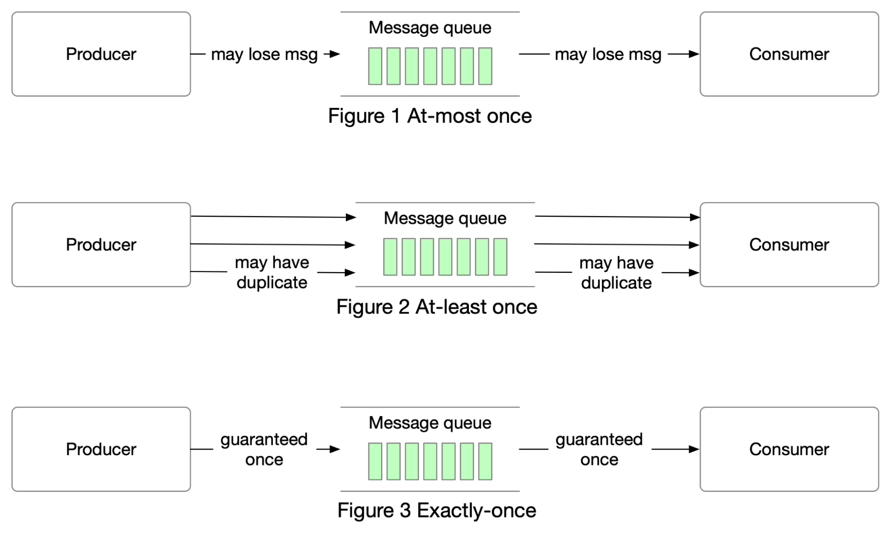

# 📨 消息投递语义！至多一次、至少一次、恰好一次

> 消息队列最核心的概念，面试必考

消息队列的三种投递语义，各有适用场景 👇

📌 **至多一次（At-most once）**
- 消息最多投递一次，可能丢失但不会重复
- 适用场景：监控指标等允许少量数据丢失的场景

📌 **至少一次（At-least once）**
- 消息不会丢失，但可能重复投递
- 适用场景：数据重复不是大问题，或消费端可以去重
- 例如：用消息中的唯一键在写入数据库时去重

📌 **恰好一次（Exactly once）**
- 最难实现，对系统性能和复杂度要求最高
- 适用场景：金融相关（支付、交易、记账）
- 当下游不支持幂等性且不允许重复时必须使用

💡 大多数场景用"至少一次+消费端去重"就够了，恰好一次的成本很高，只在金融等关键场景使用。

---

#消息队列 #Kafka #分布式系统 #系统设计 #程序员 #技术干货
