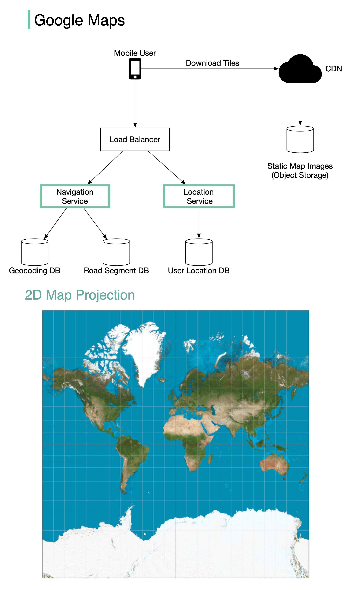

# 🗺️ 设计Google Maps！10亿日活的地图系统怎么做

> 三大核心组件拆解Google Maps的架构

Google Maps有10亿日活用户，覆盖全球99%的区域。拆解成3个核心组件 👇

📌 **定位服务（Location Service）**
- 客户端每几秒发送位置更新
- 用途：检测新路/关闭的路、提升地图精度、实时交通数据

📌 **地图渲染（Map Rendering）**
- 世界地图投影成2D大图，切成小块"瓦片"
- 静态瓦片通过CDN+S3分发
- 不同缩放级别预计算地图块，按需加载

📌 **导航服务（Navigation Service）**
调用两个子服务：
1. 地理编码服务 — 地址转经纬度
2. 路线规划服务：
   - 计算A到B的Top-K最短路径
   - 基于实时+历史交通数据估算时间
   - 按时间和用户偏好（如避开收费站）排序

💡 地图系统的核心挑战：海量数据的高效存储和分发、实时交通数据处理、路径算法优化。

---

#GoogleMaps #系统设计 #面试 #程序员 #后端开发 #技术干货
