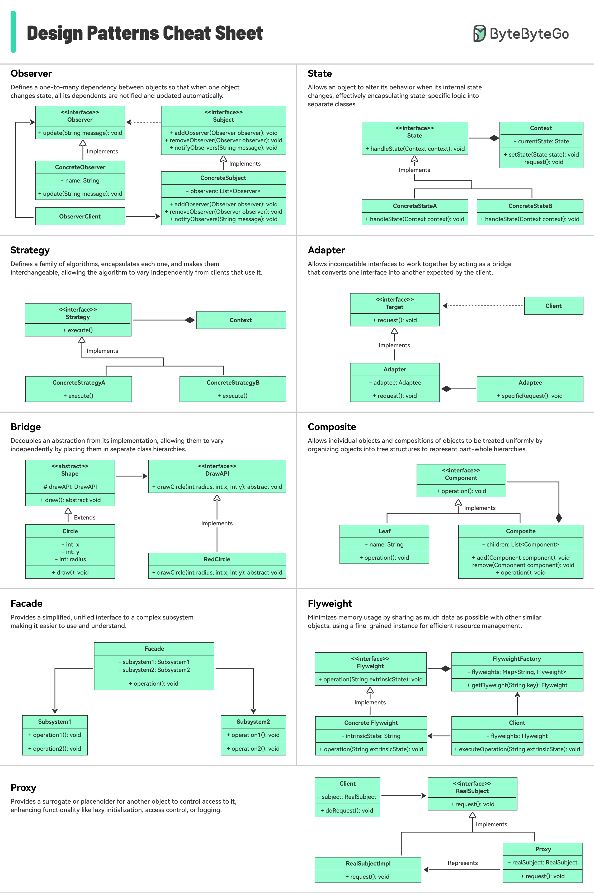

# 🎨 设计模式速查表！常用模式一图速览

> 工厂、建造者、单例、责任链……一张图搞定

设计模式速查表，简要解释每个模式及其用法 👇

包含的模式：
📌 工厂模式（Factory）
📌 建造者模式（Builder）
📌 原型模式（Prototype）
📌 单例模式（Singleton）
📌 责任链模式（Chain of Responsibility）
📌 还有更多……

💡 设计模式不用全记住，理解核心思想，遇到具体问题时能想到用哪个就够了。

---

#设计模式 #软件架构 #编程 #程序员 #面试 #技术干货
