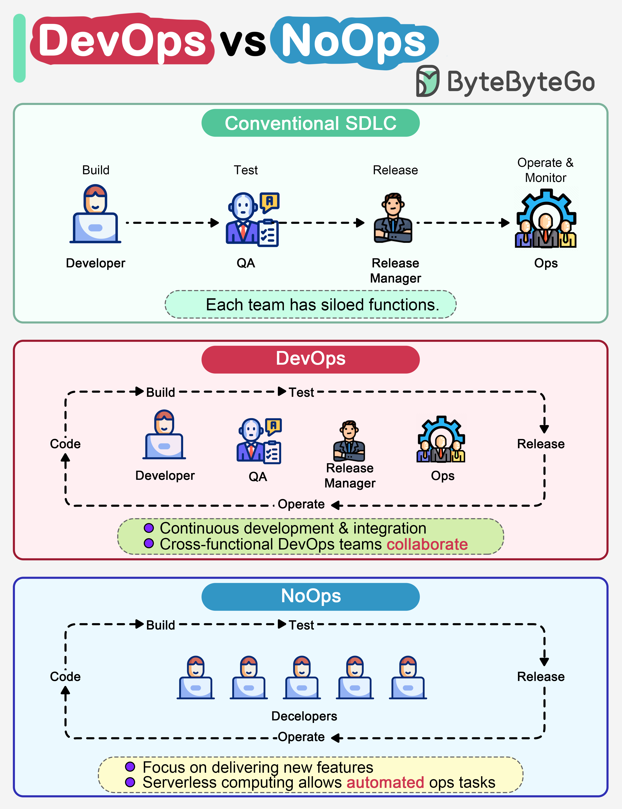

# 🔄 DevOps vs NoOps！软件开发模式的进化

> 从传统开发到DevOps再到NoOps，效率越来越高

软件开发模式的三个阶段 👇

📌 **传统SDLC**
- 编码、构建、测试、发布、监控各自独立
- 每个阶段独立工作，交接给下一阶段

📌 **DevOps**
- 开发和运维持续协作
- 缩短整体生命周期
- 实现持续交付

📌 **NoOps**
- 基于Serverless（FaaS + BaaS）
- 云服务商处理大部分运维工作
- 开发者专注功能开发
- 比DevOps进一步缩短SDLC

💡 NoOps适合创业公司和小规模应用，大型系统目前还是DevOps更实际。

---

#DevOps #NoOps #Serverless #程序员 #软件开发 #技术干货
