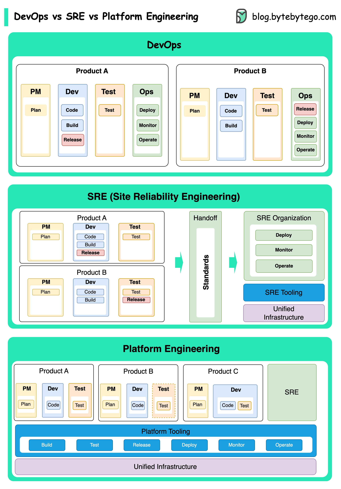

# 🔧 DevOps vs SRE vs

> 都是为了提升效率，但侧重点不同

三个概念出现在不同时期，各有侧重 👇

📌 **DevOps（2009年）**
- 由Patrick Debois提出
- 打破开发和运维的壁垒
- 强调协作文化和共同责任

📌 **SRE（2000年代初）**
- Google首创
- 用软件工程方法解决运维问题
- 关注大规模系统的可靠性和效率

📌 **平台工程（较新）**
- 建立在DevOps和SRE基础上
- 为产品开发提供完整平台
- 支持整个业务视角

💡 简单理解：DevOps是文化，SRE是实践，平台工程是产品。三者互补而非互斥。

---

#DevOps #SRE #平台工程 #程序员 #运维 #技术干货
