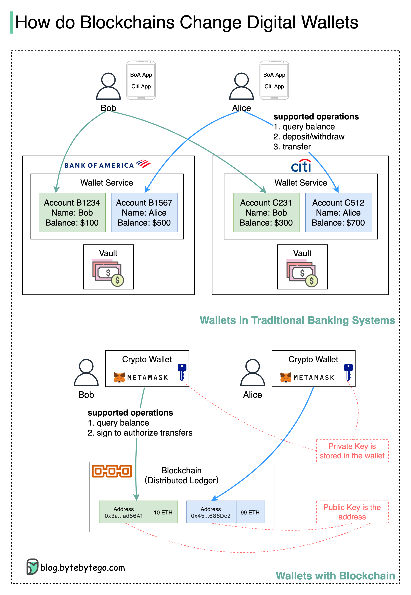

# 🏦 银行数字钱包 vs 区块链钱包！有什么不同？

> VISA和PayPal为什么投资区块链？看完就懂了

传统银行钱包和区块链钱包的对比 👇

📌 **银行系统**
- 存款：去银行开户存钱，每家银行要单独开户
- 转账：Bob从BoA转$50给Alice的Citi账户，实际资金日终才结算
- 取款：从账户扣款，拿到现金

📌 **区块链**
- 存取：生成地址+私钥，存入加密钱包（如MetaMask），无需现金
- 转账：输入对方地址，用私钥签名授权，链上确认后准实时到账

🔑 **核心区别**
- 银行：多家银行多个账户 → 区块链：一个地址走天下
- 银行：日终对账结算 → 区块链：准实时确认
- 银行：各自独立的钱包服务 → 区块链：统一的全球服务

💡 区块链的分布式账本提供了统一接口，简化了钱包操作。这就是VISA和PayPal投资区块链的原因。

---

#区块链 #数字钱包 #金融科技 #支付 #程序员 #技术干货
