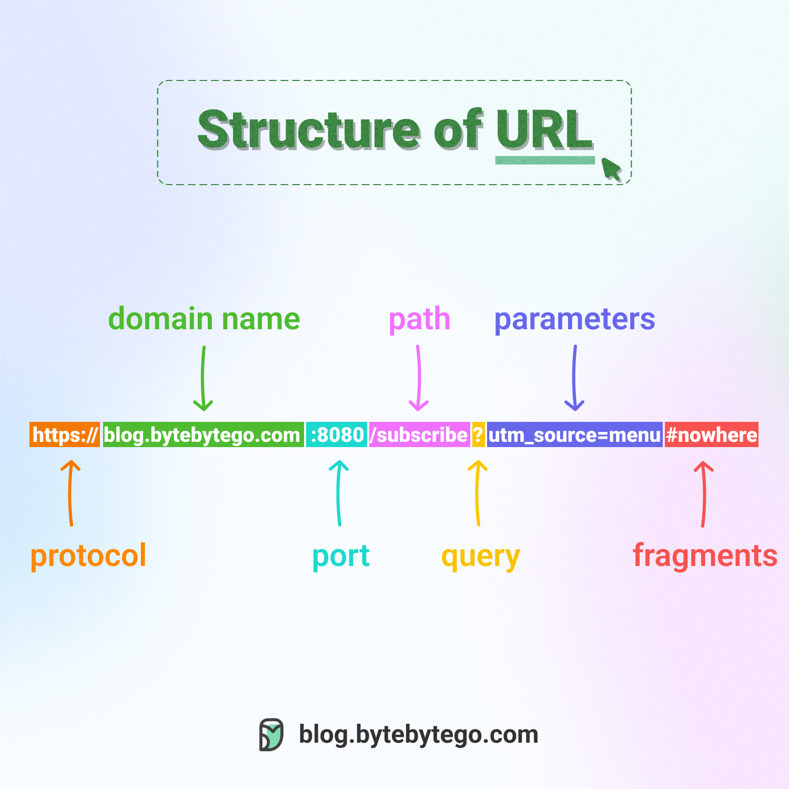

# 🔗 你知道URL的所有组成部分吗？

> 天天输入网址，但你真的了解URL的结构吗？

URL（统一资源定位符）的完整结构 👇

📌 **协议/方案** — http、https、ftp等

📌 **域名和端口** — 用点号分隔

📌 **资源路径** — 用斜杠分隔

📌 **参数** — 问号开头，键值对形式（?a=b&c=d）

📌 **片段/锚点** — 井号开头（#section），定位到资源的特定部分

💡 面试小知识：URL不只是网页地址，它定位的是"资源"。理解URL结构对Web开发和API设计都很重要。

---

#URL #Web开发 #网络 #程序员 #计算机基础 #技术干货
