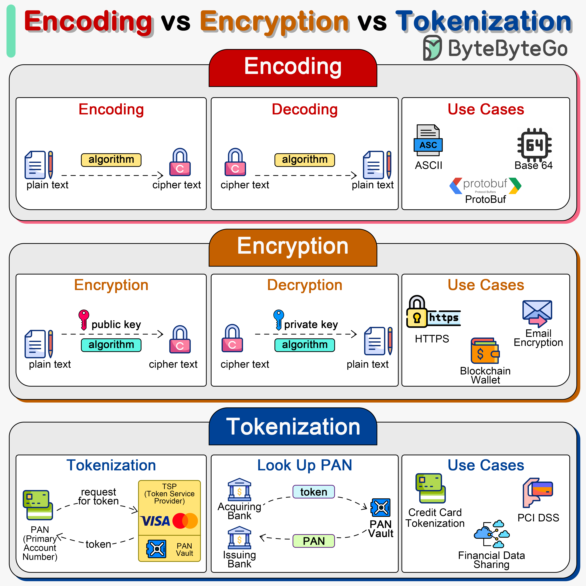

# 🔐 编码 vs 加密 vs 令牌化

> 处理敏感数据时，选对方式至关重要

三种数据处理方式，用途完全不同 👇

📌 **编码（Encoding）**
- 用可逆方案转换数据格式（如Base64）
- 不需要密钥就能解码
- 目的：方便数据传输，不是为了安全

📌 **加密（Encryption）**
- 用算法和密钥将明文转为密文
- 对称加密：同一个密钥加解密
- 非对称加密：公钥加密，私钥解密
- 目的：保护数据机密性

📌 **令牌化（Tokenization）**
- 用无意义的令牌替代敏感数据
- 原始数据和令牌的映射存在安全的令牌库中
- 令牌不包含原始数据，无法逆向推导
- 目的：合规（如PCI DSS），保护信用卡号等

💡 简单记忆：编码不安全，加密可逆（有密钥），令牌化不可逆。处理敏感数据时要选对方式。

---

#安全 #加密 #数据保护 #程序员 #后端开发 #技术干货
