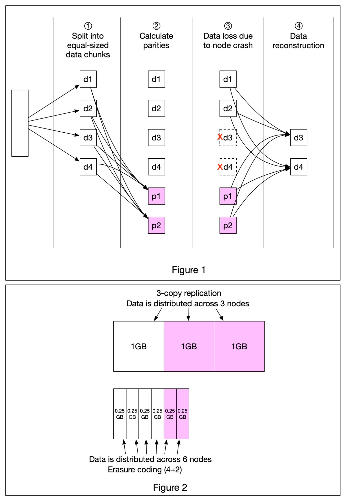

# 💿 纠删码技术！S3如何用50%冗余实现11个9的持久性

> 比三副本省空间，比三副本更可靠，这就是纠删码

S3等对象存储用纠删码（Erasure Coding）提升数据持久性，比传统副本方案更优 👇

📌 **工作原理（4+2纠删码为例）**
1. 数据拆成4个等大的数据块（d1-d4）
2. 用数学公式计算2个校验块（p1、p2）
3. 即使d3和d4丢失（节点崩溃）
4. 用d1、d2、p1、p2通过数学公式重建d3和d4

📌 **空间效率对比**
- 纠删码：50%额外存储开销
- 三副本：200%额外存储开销

📌 **持久性对比**（假设节点年故障率0.81%）
- 纠删码：11个9的持久性
- 三副本：6个9的持久性

💡 纠删码用更少的空间实现了更高的持久性，这就是为什么S3能提供99.999999999%的持久性保证。

---

#存储 #S3 #纠删码 #分布式系统 #程序员 #技术干货
