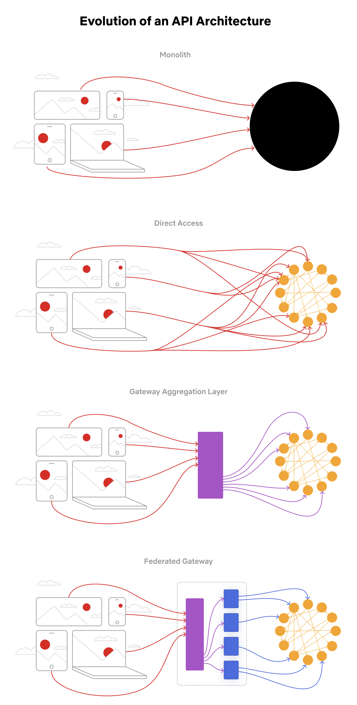

# 🎬 Netflix API架构进化4阶段！从单体到联邦网关

> Netflix的API架构是怎么一步步演进的？

Netflix API架构经历了4个主要阶段 👇

1️⃣ **单体（Monolith）**
打包部署为单个应用，大多数创业公司的起点

2️⃣ **直接访问（Direct Access）**
客户端直接请求微服务。但数百上千个微服务全暴露给客户端不理想

3️⃣ **网关聚合层（Gateway Aggregation）**
有些场景需要跨多个服务。比如Netflix App需要电影、制作、演员3个API来渲染前端，网关聚合层让这成为可能

4️⃣ **联邦网关（Federated Gateway）**
随着开发者增多和领域复杂度增加，聚合层开发越来越难。GraphQL联邦让Netflix建立单一GraphQL网关，从所有其他API获取数据

💡 Netflix的进化路径：单体→直接访问→网关聚合→联邦网关。每一步都是为了解决上一步的痛点。

---

#Netflix #API #GraphQL #系统架构 #程序员 #技术干货 #大厂案例
