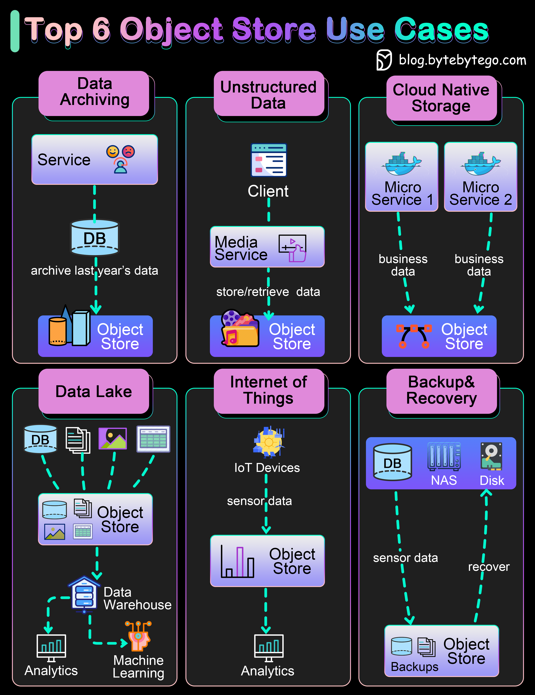

# 📦 对象存储的6大使用场景！S3不只是存文件

> 对象存储灵活、可扩展，适用场景比你想的多

对象存储（如S3、GCS、Azure Blob）把元数据和对象一起存储，灵活且易扩展。6大使用场景 👇

1️⃣ **数据归档** — 把旧数据归档到对象存储，成本低，满足审计需求

2️⃣ **非结构化数据存储** — 音乐、视频、文档等。Spotify和Netflix都用对象存储存媒体文件

3️⃣ **云原生存储** — 云原生应用需要灵活可扩展的存储，主流云厂商都有简单的API

4️⃣ **数据湖** — 不同业务线把数据dump到对象存储，后续做分析或机器学习

5️⃣ **IoT数据** — IoT传感器产生的时序数据，存入对象存储后做分析或AI

6️⃣ **备份恢复** — 存储数据库或文件系统备份，需要时快速恢复

💡 对象存储 vs 文件存储 vs 块存储：对象存储适合大量非结构化数据，文件存储适合层级结构，块存储适合数据库。

---

#对象存储 #S3 #云计算 #数据存储 #程序员 #技术干货
