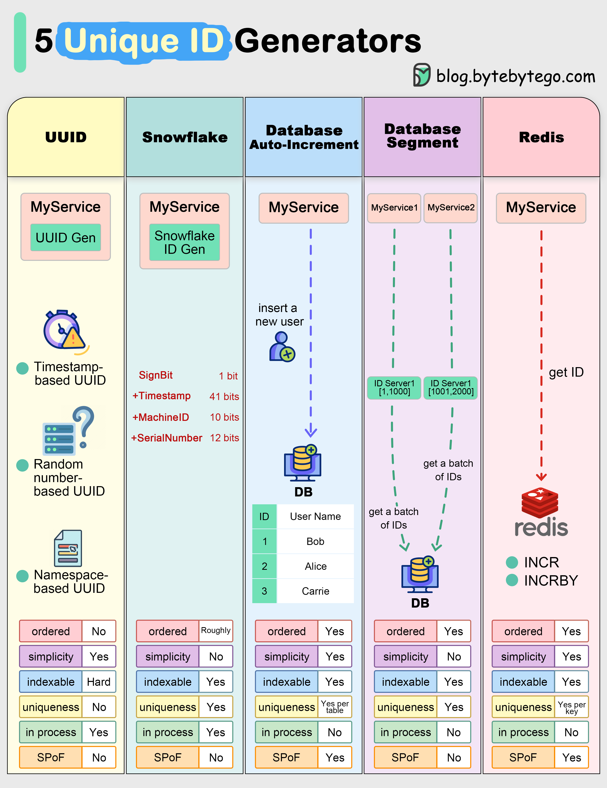

# 🆔 分布式系统5种唯一ID生成器！各有优劣

> 分布式环境下生成唯一ID，没你想的那么简单

分布式系统中生成唯一ID的5种方案 👇

1️⃣ **UUID**
- 128位，本地生成不需要网络调用
- 缺点：不连续，数据库索引效率低，不保证全局唯一（虽然冲突概率极低）

2️⃣ **Snowflake（雪花算法）**
- 时间戳+机器ID+序列号
- 不需要网络调用，快速可扩展
- 可加数据中心ID保证全局唯一

3️⃣ **数据库自增**
- 利用数据库事务管理保证唯一性
- 缺点：需要网络通信，可能暴露业务数据（如用户总数）

4️⃣ **数据库号段模式**
- 批量从数据库获取ID缓存到ID服务器
- 大幅减少数据库I/O压力

5️⃣ **Redis**
- 用Redis键值对生成唯一ID
- 内存操作，性能比数据库好

💡 推荐：大多数场景用Snowflake就够了，简单高效。需要全局有序用数据库号段模式。

---

#分布式系统 #唯一ID #雪花算法 #系统设计 #程序员 #技术干货
