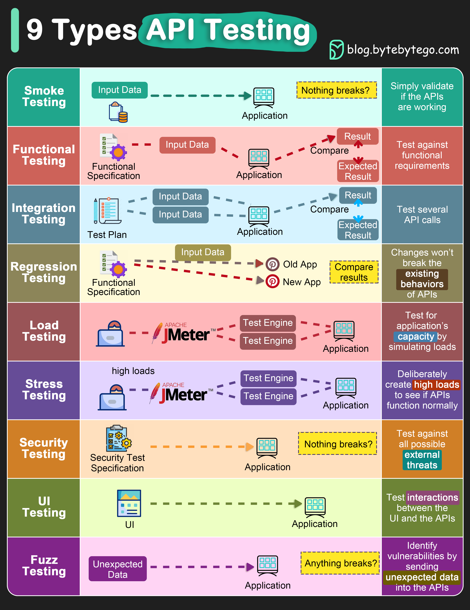

# 🧪 API测试的9种类型！保障接口质量的完整方案

> 不只是功能测试，API测试还有这么多种

API测试的9种类型，覆盖质量保障的方方面面 👇

1️⃣ **冒烟测试** — API开发完成后，验证基本功能是否正常

2️⃣ **功能测试** — 根据功能需求创建测试计划，对比实际结果和预期

3️⃣ **集成测试** — 组合多个API调用做端到端测试，验证服务间通信

4️⃣ **回归测试** — 确保修bug或新功能不会破坏现有API行为

5️⃣ **负载测试** — 模拟不同负载测试性能，计算应用容量

6️⃣ **压力测试** — 故意制造高负载，测试API在极端条件下能否正常工作

7️⃣ **安全测试** — 测试API对所有外部威胁的防御能力

8️⃣ **UI测试** — 测试UI与API的交互，确保数据正确显示

9️⃣ **模糊测试** — 注入无效或意外输入，尝试让API崩溃，发现漏洞

💡 日常开发中，功能测试+集成测试+回归测试是最基本的三件套。

---

#API测试 #软件测试 #质量保障 #程序员 #后端开发 #技术干货
