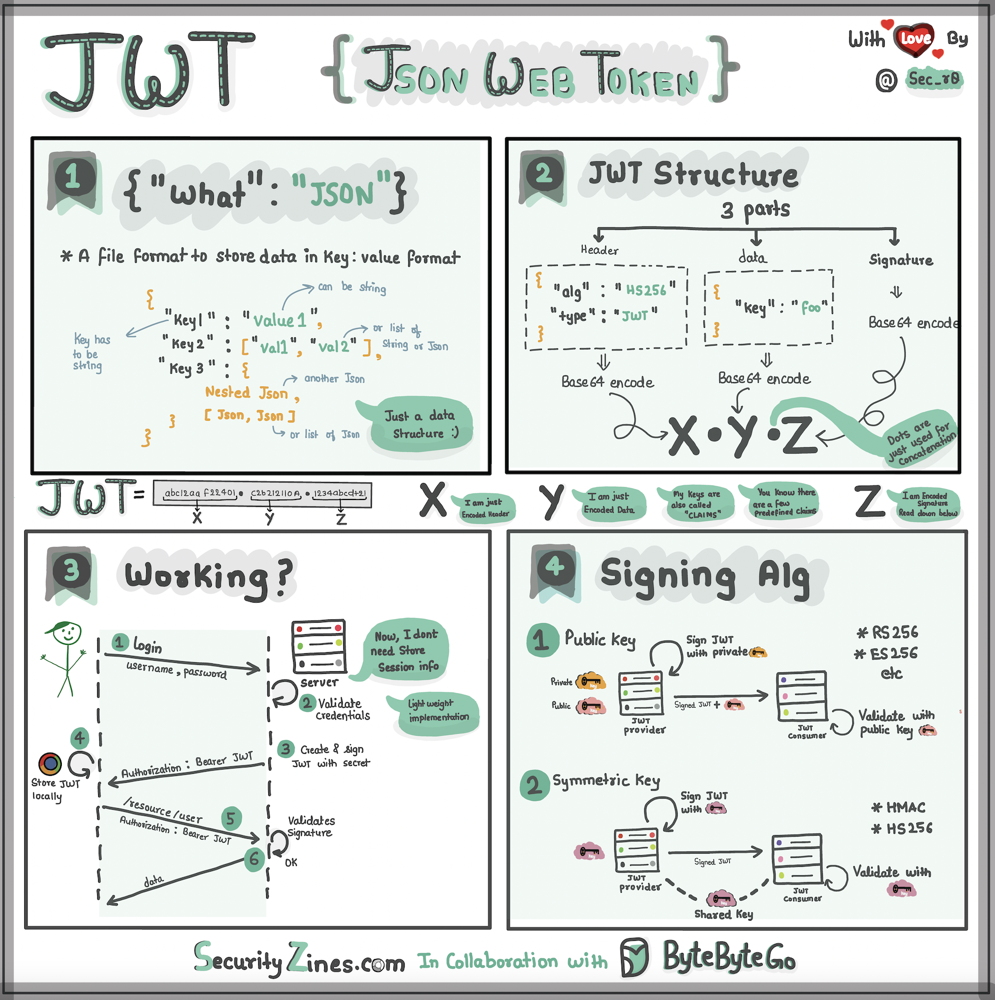

# 🔑 用小学生能懂的方式解释JWT！

> JWT就像一个有密封条的特殊盒子

想象你有一个叫JWT的特殊盒子，里面有三个部分 👇

📌 **头部（Header）**
就像盒子外面的标签，告诉我们这是什么类型的盒子，怎么加密的

📌 **载荷（Payload）**
盒子里的实际内容——你的名字、年龄或其他要分享的信息

📌 **签名（Signature）**
让JWT安全的关键！就像只有发送者知道怎么制作的特殊封条。用一个秘密密码创建，确保没人能偷偷篡改盒子里的内容

📌 **工作流程**
1. 把头部、载荷、签名放进盒子
2. 发送给服务器
3. 服务器读取头部和载荷，知道你是谁、想做什么

💡 JWT的本质：一个自包含的、可验证的信息载体。服务器不需要查数据库就能验证你的身份。

---

#JWT #认证 #安全 #程序员 #编程入门 #技术干货
