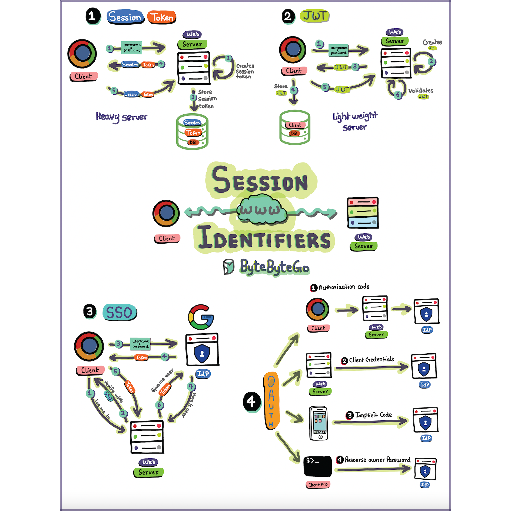

# 🔐 Session、Token、JWT、

> Web认证授权的5大概念，一张图搞定

Web会话管理的核心概念，理解这些"幕后操作"才能构建安全无缝的用户体验 👇

📌 **Session** — 服务端存储会话状态
📌 **Token** — 客户端持有的凭证
📌 **JWT** — 自包含的无状态令牌
📌 **SSO** — 单点登录，一次登录多处使用
📌 **OAuth** — 授权框架，允许第三方有限访问

💡 这些技术的演进反映了Web应用从简单到复杂的发展历程。理解它们的区别和适用场景，是后端开发的基本功。

---

#认证 #授权 #JWT #SSO #OAuth #程序员 #安全 #技术干货
