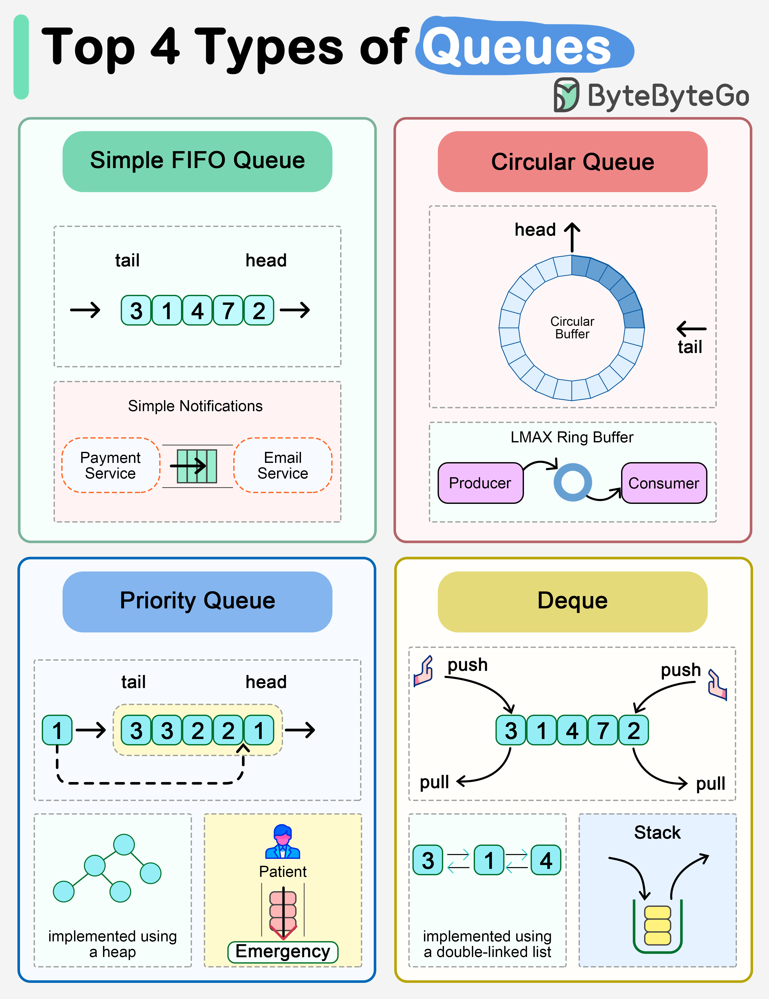

# 📬 4种最常用的队列类型！一图搞懂

> FIFO、循环队列、优先队列、双端队列，各有妙用

队列是系统中广泛使用的数据结构，4种最常用的类型 👇

1️⃣ **简单FIFO队列**
- 先进先出，尾部插入头部删除
- 场景：收到支付响应后按顺序发送邮件通知

2️⃣ **循环队列（环形缓冲区）**
- 最后一个元素连接第一个元素
- 场景：LMAX的低延迟环形缓冲区，交易组件通过它通信，内存实现超快

3️⃣ **优先队列**
- 按优先级取出元素，底层用最大堆/最小堆实现
- 场景：急诊室按病情严重程度分配患者

4️⃣ **双端队列（Deque）**
- 头尾都能插入和删除
- 支持FIFO和LIFO，可以用来实现栈

💡 选择队列类型取决于你的场景：普通排队用FIFO，高性能用环形缓冲区，有优先级用优先队列。

---

#数据结构 #队列 #编程 #程序员 #计算机基础 #技术干货
