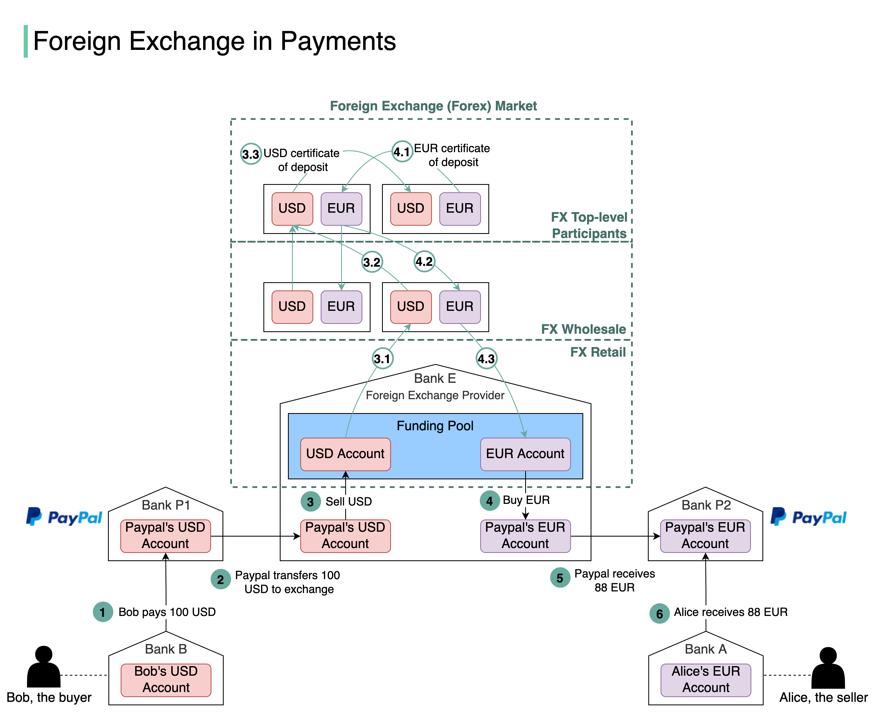

# 💱 外汇支付是怎么工作的

> 买家付美元，卖家收欧元，中间发生了什么？

Bob用USD付款，Alice收EUR，这个过程叫外汇支付 👇

📌 **支付流程**
1. Bob通过PayPal发送100 USD
2. PayPal需要把USD换成EUR，找外汇提供商（Bank E）
3. 100 USD卖给Bank E的资金池
4. 资金池提供88 EUR
5. PayPal的EUR账户收到88 EUR
6. 88 EUR支付到Alice的账户

📌 **外汇市场三层结构**
- 零售市场 — PayPal等支付商通常提前购买外币
- 批发市场 — 投行、商业银行处理零售市场的累积订单
- 顶级参与者 — 持有大量多国货币的跨国商业银行

💡 跨境支付的成本主要来自汇率差和手续费。PayPal提前买入外币是为了提高效率和锁定汇率。

---

#外汇 #跨境支付 #金融科技 #支付 #程序员 #技术干货
